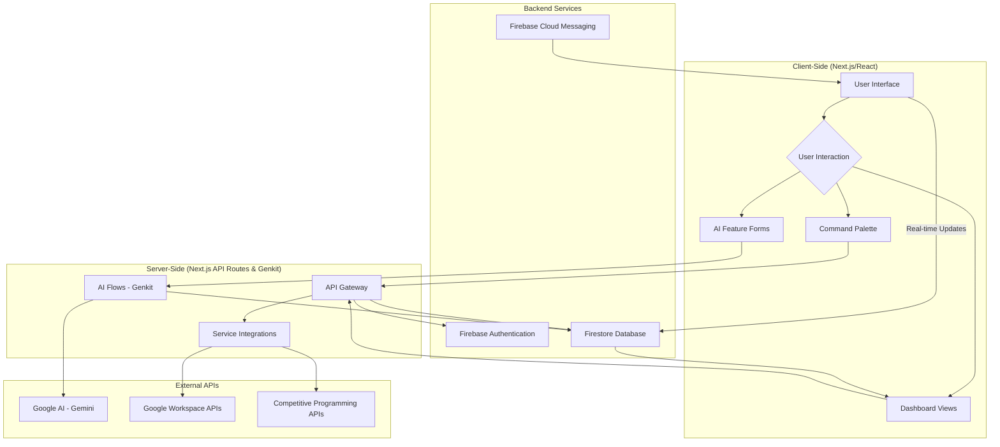
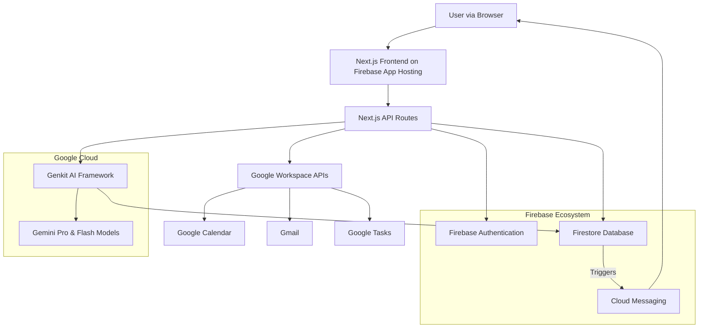
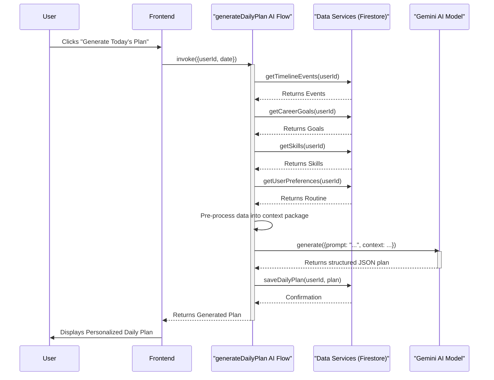

# Project Synopsis: FutureSight - An AI-Powered Career Planning Assistant

## 1. Introduction

FutureSight is an intelligent, AI-powered web application designed to serve as a comprehensive career planning and time management assistant for college students and early-career professionals. In an era of information overload and intense competition, young individuals are often overwhelmed by the need to manage academic responsibilities, develop new skills, prepare for competitive exams, and make strategic career choices simultaneously. Traditional digital calendars and task managers function as passive repositories of information, lacking the intelligence to help users prioritize, strategize, and connect their daily actions to long-term aspirations. 

FutureSight aims to bridge this gap by transforming the digital calendar from a simple scheduling tool into a proactive, intelligent co-pilot. By leveraging the power of advanced Generative AI models like Google's Gemini, the application provides personalized daily plans, generates comprehensive career roadmaps from natural language descriptions, and offers a unified dashboard to track progress across all facets of a user's academic and professional life. The system integrates seamlessly with existing ecosystems like Google Calendar and Tasks, creating a central hub that not only organizes a user's time but also enriches it with context-aware insights and actionable guidance.

## 2. Literature Review

The domain of personal productivity software is mature, with several established categories of tools. A review of the existing literature and market reveals the following:

*   **Traditional Calendar Applications (e.g., Google Calendar, Microsoft Outlook):** These tools are ubiquitous and excel at time-blocking and event scheduling. However, their core functionality has remained largely unchanged. They are passive systems that require manual input for all events and do not offer intelligent suggestions, prioritization, or analysis of the user's schedule in the context of their long-term goals. They are effective "what" and "when" tools but fail to address the "how" and "why."

*   **Task Management Tools (e.g., Todoist, Trello, Asana):** These platforms are excellent for organizing and tracking discrete tasks. They often include features for prioritization, deadlines, and project-based organization. However, they are typically disconnected from the user's calendar, leading to a fragmented workflow where tasks must be manually scheduled. They manage the to-do list but do not inherently help in managing the time required to complete it.

*   **All-in-One Productivity Workspaces (e.g., Notion, Coda):** These tools offer powerful, flexible databases and document-based systems that allow users to build custom productivity solutions. While highly capable, they present a steep learning curve and require significant upfront effort to design and maintain a cohesive system. They are a "box of bricks" rather than a ready-to-use solution, and lack the built-in, proactive AI intelligence for automated planning and guidance.

*   **Emerging AI Assistants:** The recent advent of Large Language Models (LLMs) has introduced a new paradigm of AI-powered assistants. Tools are emerging that can summarize text, answer questions, and generate content. However, few have successfully integrated this intelligence directly and proactively into a user's personal time management and career planning workflow in a persistent, context-aware manner.

This review indicates a clear gap in the market for a tool that synthesizes the strengths of these categories: the time management of a calendar, the organization of a task manager, the flexibility of a workspace, and the proactive intelligence of an AI assistant, all tailored to the specific needs of students and young professionals.

## 3. Objectives

The primary objectives of the FutureSight project are:

1.  **To Develop a Unified Planning Ecosystem:** Create a single, integrated web application that consolidates calendar events, tasks, long-term career goals, and skill development tracking, eliminating the need for multiple, disconnected tools.
2.  **To Implement Proactive AI-Powered Planning:** Leverage Google's Genkit framework and Gemini models to analyze user data and automatically generate personalized, optimized daily schedules that align with their long-term aspirations.
3.  **To Provide Intelligent Career Guidance:** Develop an AI-driven "Career Vision" feature that can process natural language descriptions of a user's passions and goals to produce a comprehensive, actionable, multi-step career roadmap.
4.  **To Enhance Motivation through Gamification:** Integrate features such as daily streaks, experience points (XP), and a competitive leaderboard to encourage consistent user engagement and habit formation.
5.  **To Ensure Seamless Integration and Extensibility:** Build robust, secure integrations with third-party services like Google Workspace (Calendar, Tasks, Gmail) and create a modular plugin architecture (Extension Marketplace) to allow for future feature expansion.

## 4. Problem Statement

Modern students and early-career professionals face a significant "strategy gap" in their personal and professional development. They are equipped with numerous digital tools for managing individual tasks and appointments but lack a system that provides a strategic, holistic view of their journey. The core problem is the fragmentation of information and the passive nature of existing tools, which leads to several critical issues:

*   **Reactive Time Management:** Users plan their time in response to immediate deadlines rather than proactively scheduling activities that align with long-term goals.
*   **Lack of Connection:** Daily tasks (e.g., "study DSA for 1 hour") are disconnected from overarching goals (e.g., "become a Senior Software Engineer"), leading to a feeling of being busy but not productive.
*   **Information Overload and Decision Fatigue:** The constant influx of information about exams, skills, and job opportunities makes it difficult to prioritize and create a focused plan of action.
*   **High Friction, Low Motivation:** Manually maintaining separate systems for goals, skills, and schedules is tedious and demotivating, often leading to abandonment of the planning process altogether.

FutureSight directly addresses this by creating an intelligent system that automates the strategic thinking, connects daily actions to future outcomes, and reduces the friction of holistic planning.

## 5. Proposed Method

The FutureSight application is built on a modern, full-stack architecture designed for scalability, intelligence, and a rich user experience.

1.  **Technology Stack:** The application utilizes a robust stack:
    *   **Frontend:** Next.js with React and TypeScript for a type-safe, component-based, and performant user interface.
    *   **Styling:** Tailwind CSS and ShadCN UI components for rapid, aesthetically pleasing, and responsive design.
    *   **Backend & Database:** The entire backend is powered by the Firebase ecosystem, including Firestore for a real-time NoSQL database, Firebase Authentication for secure user management, and Firebase Cloud Messaging for push notifications.
    *   **AI Framework:** Google's Genkit is used as the core framework to structure, manage, and deploy all generative AI features, ensuring reliable and maintainable AI workflows.

2.  **AI Integration (Model Context Protocol):** The "intelligence" of the application is achieved through a "Model Context Protocol" (MCP). Before invoking an AI model for a task (like daily planning), the system gathers a comprehensive context package that includes:
    *   User's defined career goals and their current progress.
    *   List of skills the user is tracking.
    *   Fixed appointments and events from their calendar for the given day/week.
    *   User's predefined weekly routine (e.g., college hours, sleep schedule).
    *   This context is then injected into a structured prompt, enabling the Gemini model to act as a personalized coach and generate a highly relevant and actionable plan.

3.  **Data Synchronization:** The system uses secure OAuth 2.0 to connect to Google Workspace APIs. It fetches calendar events, tasks, and email headers, processes them through an AI flow to extract actionable insights, and seamlessly integrates them into the user's timeline. All data is synchronized and stored per-user in Firestore.

4.  **Extensibility:** A plugin architecture is designed where each extension is a self-contained React component. A central service manages the installation state, and the UI dynamically renders the components of installed plugins, allowing for easy expansion of features.

## 6. Block Diagram

## 7. System Architecture Diagrams

### High-Level System Architecture

### AI Daily Plan Generation Flow

## 8. Conclusion

FutureSight presents a novel approach to personal productivity by creating a symbiotic relationship between the user and an intelligent AI assistant. By moving beyond the passive, "dumb container" paradigm of traditional calendars, the application actively assists users in formulating and executing a cohesive strategy for their personal and professional growth. The proposed architecture, centered around the "Model Context Protocol," ensures that the AI's guidance is not generic but deeply personalized and contextually relevant. Through its integrated feature set, gamified environment, and extensible nature, FutureSight is poised to become an indispensable tool for ambitious individuals navigating the complexities of modern career development, ultimately helping them turn long-term vision into daily, manageable reality.

## 9. References

*   **Next.js Documentation:** [https://nextjs.org/docs](https://nextjs.org/docs)
*   **Firebase Documentation:** [https://firebase.google.com/docs](https://firebase.google.com/docs)
*   **Google AI & Genkit:** [https://developers.google.com/ai](https://developers.google.com/ai)
*   **ShadCN UI Components:** [https://ui.shadcn.com/](https://ui.shadcn.com/)
*   Norman, D. A. (1988). *The Design of Everyday Things*. Basic Books. (Conceptual reference for user-centric, intuitive design).
*   Eyal, N. (2014). *Hooked: How to Build Habit-Forming Products*. Portfolio. (Reference for gamification and user engagement loops).

## 10. LINKS

*   **Live Prototype:** [http://futuresight-8ebba4468907.herokuapp.com](http://futuresight-8ebba4468907.herokuapp.com)
*   **Project Repository:** [https://github.com/AshishYesale7/FutureSight](https://github.com/AshishYesale7/FutureSight)
