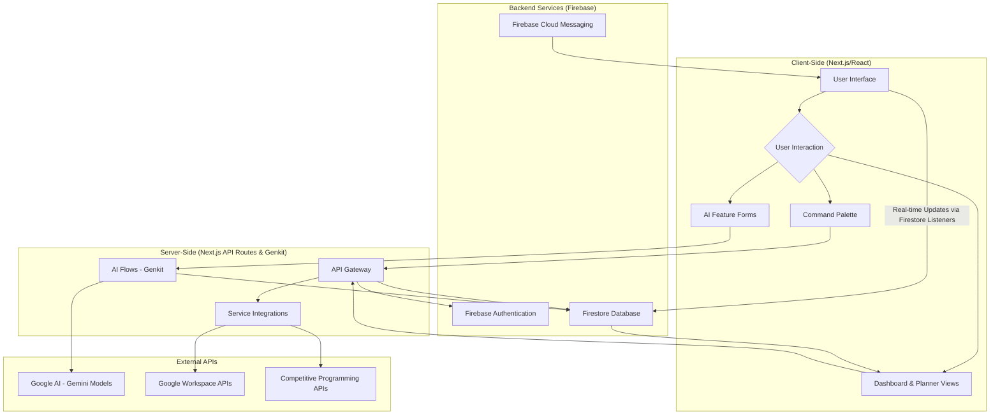
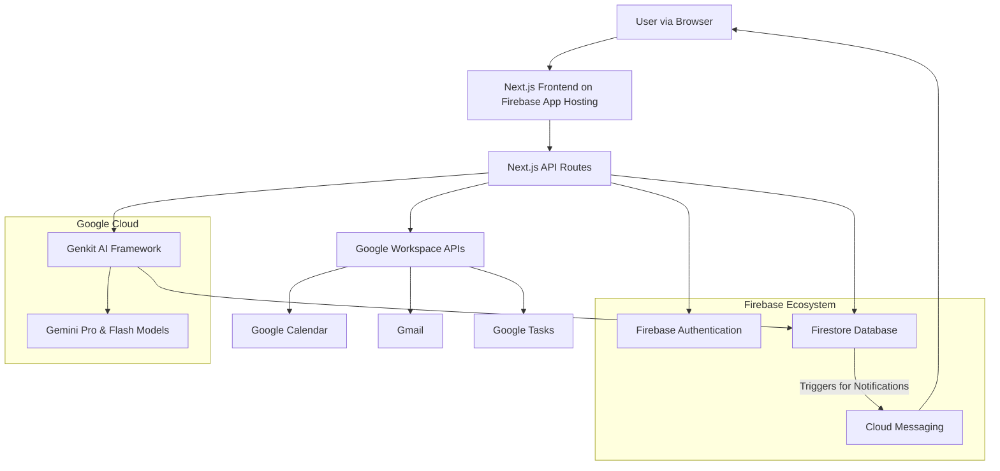
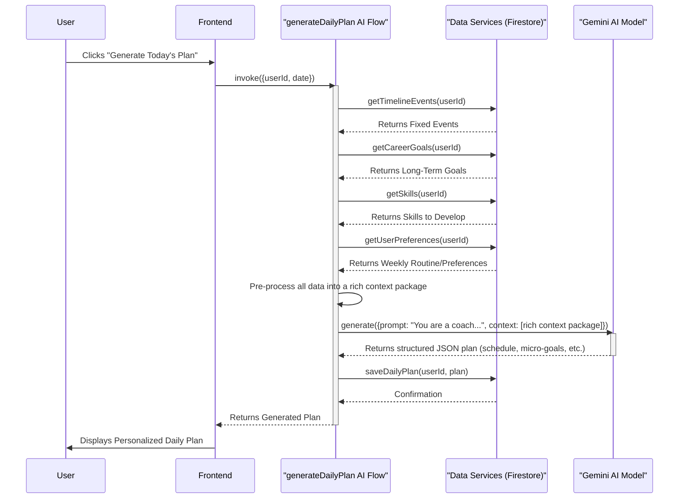

# Project Synopsis: FutureSight - An AI-Powered Career Planning Assistant

## 1. Introduction

FutureSight is an intelligent, AI-powered web application meticulously designed to serve as a comprehensive career planning and time management assistant for the modern-day college student and early-career professional. In an era characterized by an unprecedented influx of information and intense competition, young individuals find themselves at a complex crossroads, often overwhelmed by the multifaceted challenge of simultaneously managing academic responsibilities, acquiring new-age technical skills, preparing for a battery of competitive entrance examinations (such as GATE, GRE, CAT), and making strategic, long-term career choices. The existing ecosystem of digital productivity tools, including traditional calendars and task managers, largely functions as a set of passive repositories for information. These tools, while effective for basic scheduling, lack the requisite intelligence to assist users in prioritizing tasks, formulating cohesive strategies, or connecting their day-to-day actions to their long-term aspirations. They are effective at capturing the "what" and "when" but fall short of addressing the crucial "how" and "why" of personal development.

FutureSight is engineered to bridge this critical gap. It aims to fundamentally transform the digital calendar from a static, simple scheduling utility into a proactive, intelligent co-pilot for one's career journey. By harnessing the formidable power of advanced Generative AI models, specifically Google's Gemini family, the application provides deeply personalized daily plans, generates comprehensive and actionable career roadmaps from natural language descriptions, and offers a unified, holistic dashboard to track progress across all facets of a user's academic and professional life. The system is designed for seamless integration with the user's existing digital life, including Google Calendar and Google Tasks, creating a centralized hub that not only organizes a user's time but also enriches it with context-aware insights, intelligent suggestions, and actionable guidance. At its core, FutureSight is not just about managing time; it's about making time matter, ensuring that every hour spent is an investment in a well-defined and ambitious future. It introduces a paradigm where planning is no longer a reactive chore but a dynamic, motivating, and collaborative process between the user and their AI assistant.

## 2. Literature Review

The domain of personal productivity software is a mature and saturated market, with several well-established categories of tools that have shaped user expectations and workflows. A comprehensive review of the existing literature and market landscape reveals a clear and persistent gap that FutureSight is uniquely positioned to fill.

*   **Traditional Calendar Applications (e.g., Google Calendar, Microsoft Outlook, Apple Calendar):** These applications are ubiquitous and have become the de facto standard for time-blocking and event scheduling. Their core strength lies in providing a visual representation of time, allowing users to allocate specific slots for appointments and events. However, their fundamental functionality has remained largely static for over a decade. They are inherently passive systems that depend entirely on manual data entry for all events. They lack any built-in intelligence to offer suggestions for time management, analyze the user's schedule for potential optimizations, or connect scheduled tasks to broader, long-term objectives. In essence, they are powerful for documenting a plan but offer no assistance in formulating one.

*   **Task Management Tools (e.g., Todoist, Trello, Asana, Microsoft To Do):** These platforms excel at organizing, categorizing, and tracking discrete tasks and to-do lists. They often incorporate features for setting priorities, assigning deadlines, and organizing tasks into projects. While excellent for managing the "what" of productivity, they are typically disconnected from the "when." This leads to a fragmented workflow where the user must manually bridge the gap between their task list and their calendar, a process that is both time-consuming and prone to poor estimation. They manage the inventory of tasks but do not inherently help in managing the finite resource of time required to complete them.

*   **All-in-One Productivity Workspaces (e.g., Notion, Coda, Airtable):** This category of tools offers a paradigm shift towards flexibility and customization. They provide powerful, database-driven environments where users can build their own bespoke productivity systems from scratch. While incredibly capable for power users, this strength is also their primary weakness for the average user: they present a steep learning curve and demand a significant upfront investment in system design, setup, and ongoing maintenance. They are akin to a "box of bricks" rather than a ready-to-use, opinionated solution. Furthermore, they lack the built-in, proactive AI intelligence for automated planning, guidance, and strategic analysis that FutureSight proposes.

*   **Emerging AI-Powered Assistants:** The recent and rapid advancements in Large Language Models (LLMs) have ushered in a new wave of AI assistants. Tools are emerging that can summarize text, answer questions, and generate content on demand. However, very few have successfully managed to integrate this intelligence directly and proactively into the fabric of a user's personal time management and career planning workflow. These assistants are often conversational and exist in a separate context, requiring the user to manually feed them information for each interaction. They lack the persistent, context-aware understanding of a user's goals, skills, and schedule that is necessary to provide truly personalized and automated guidance.

This literature review clearly indicates a significant opportunity for a "fourth-generation" productivity tool. FutureSight aims to synthesize the core strengths of these distinct categories: the structured time management of a calendar, the organizational power of a task manager, the data-rich flexibility of an all-in-one workspace, and the proactive, context-aware intelligence of a dedicated AI assistant, all packaged into a single, cohesive ecosystem tailored to the specific, high-stakes needs of students and young professionals.

## 3. Objectives

The primary objectives of the FutureSight project are defined to address the identified gaps in the current productivity software market and to deliver a transformative user experience. These objectives guide the development process and define the core value proposition of the application.

1.  **To Develop a Unified and Holistic Planning Ecosystem:** The foremost objective is to create a single, seamlessly integrated web application that consolidates all critical aspects of a student's or professional's life. This involves breaking down the silos that currently exist between calendar events, academic deadlines, project tasks, long-term career goals, and skill development tracking. By providing a centralized dashboard, the application will eliminate the need for users to juggle multiple, disconnected tools, thereby reducing cognitive load and providing a holistic, at-a-glance view of their entire personal and professional landscape.

2.  **To Implement Proactive, AI-Powered Daily Planning:** A core innovation of FutureSight is to move beyond passive scheduling. The objective is to leverage Google's advanced Genkit framework and Gemini models to analyze a rich set of user data—including their fixed schedule, long-term aspirations, and upcoming deadlines—to automatically generate an optimized, personalized daily plan. This plan will not be a mere list of tasks but a chronologically structured schedule that intelligently allocates time for focused work, learning, and breaks, ensuring that every day is purposefully aligned with the user's larger goals.

3.  **To Provide Intelligent and Actionable Career Guidance:** The project aims to develop a standout "Career Vision" feature that acts as a personalized AI career coach. This feature will be capable of processing a user's free-form, natural language descriptions of their passions, interests, and career aspirations. The AI will then analyze this input to generate a comprehensive, multi-faceted, and actionable career roadmap. This roadmap will include a clear vision statement, an analysis of key strengths, a categorized list of skills to develop (technical, soft, and hard), and a step-by-step plan with suggested resources, turning vague ambitions into a concrete plan of action.

4.  **To Enhance User Motivation and Engagement through Gamification:** Recognizing that consistency is the key to long-term success, a key objective is to integrate a sophisticated gamification layer. This will include features such as a daily activity streak to encourage habit formation, experience points (XP) awarded for productive engagement, and a competitive public leaderboard. These elements are designed to foster a sense of progress, achievement, and healthy competition, thereby increasing user motivation and long-term retention.

5.  **To Ensure Seamless Integration and Future-Proof Extensibility:** The application must integrate flawlessly with the user's existing digital ecosystem to minimize friction. This objective involves building robust, secure, and reliable integrations with essential third-party services, most notably Google Workspace (Calendar, Tasks, and Gmail). Furthermore, the architecture will be designed with extensibility in mind, featuring a modular plugin system (the "Extension Marketplace"). This will allow for the future development and integration of specialized tools and features without compromising the core application's stability, ensuring that FutureSight can evolve to meet the future needs of its users.

## 4. Problem Statement

Modern students and early-career professionals are navigating an increasingly complex and demanding landscape, creating a significant "strategy gap" between their daily activities and their long-term aspirations. They are equipped with an array of digital tools for managing individual tasks and appointments, but they fundamentally lack a system that provides a strategic, holistic, and intelligent overview of their personal and professional journey. The core problem lies in the fragmentation of information and the inherently passive nature of these existing tools. This leads to several critical, compounding issues that hinder progress and create significant stress:

*   **Reactive Time Management:** The vast majority of personal planning is done in a reactive, "fire-fighting" mode. Users organize their time in response to immediate deadlines, urgent tasks, and incoming requests rather than proactively scheduling activities that are aligned with their long-term, strategic goals. This creates a cycle of being perpetually busy but not necessarily productive, where urgent but unimportant tasks consistently overshadow important but non-urgent objectives like skill development and career planning.

*   **Lack of Connection and Purpose:** There is a profound disconnect between daily tasks and overarching ambitions. An action like "study DSA for 1 hour" often feels isolated from the ultimate goal of "becoming a Senior Software Engineer." This lack of a clear, visible through-line from micro-actions to macro-goals leads to a diminished sense of purpose, making it difficult to stay motivated during the day-to-day grind. Users feel like they are "treading water" rather than making tangible progress on a meaningful path.

*   **Information Overload and Decision Fatigue:** Students today are bombarded with an overwhelming amount of information from disparate sources. They face a constant influx of notifications about competitive exams (GATE, GRE, CAT), internship opportunities, new technologies to learn (Web3, AI/ML, DevOps), and essential skills to acquire (DSA, system design). This relentless stream of information, coupled with the pressure to make the "right" choices, leads to decision fatigue, analysis paralysis, and a difficulty in creating a focused, prioritized plan of action.

*   **High Friction and Low Motivation in Planning:** The manual effort required to maintain separate, siloed systems for goals, skills, project tasks, and calendar schedules is immense. This high-friction process is tedious, time-consuming, and ultimately demotivating. Users often start with the best intentions but eventually abandon their complex, multi-tool planning systems due to the sheer effort required to keep them synchronized and up-to-date, leading them to revert to a state of disorganized, reactive planning.

FutureSight is designed to directly address this multifaceted problem statement. It aims to create an intelligent, low-friction system that automates the strategic thinking involved in planning. By connecting daily actions to future outcomes, providing AI-driven clarity amidst information overload, and reducing the manual effort of holistic planning, it empowers users to close the "strategy gap" and transform their ambitions into a structured, manageable, and motivating daily reality.

## 5. Proposed Method

The FutureSight application is conceptualized and built upon a modern, full-stack architecture that is meticulously designed for scalability, intelligence, and a rich, responsive user experience. The methodology is centered around a "context-first" AI approach, ensuring that all intelligent features are deeply personalized and relevant to the user.

1.  **Technology Stack:** The application is built using a robust, modern, and type-safe technology stack chosen for its performance, developer experience, and scalability.
    *   **Frontend:** The user interface is developed with **Next.js** using the App Router, leveraging **React** and **TypeScript**. This choice enables a highly interactive, component-based UI with the benefits of server-side rendering for initial load performance and SEO. TypeScript ensures type safety across the entire codebase, reducing bugs and improving maintainability.
    *   **Styling:** A utility-first approach with **Tailwind CSS** is used for rapid and responsive UI development. This is complemented by **ShadCN UI**, a collection of beautifully designed, accessible, and reusable components, which provides a consistent and professional aesthetic.
    *   **Backend & Database:** The entire backend infrastructure is powered by the **Firebase ecosystem**. **Firestore** is used as the primary real-time NoSQL database for storing all user data, including goals, skills, and events. **Firebase Authentication** provides secure, multi-provider user management (Email, Google, Phone). **Firebase Cloud Messaging** is leveraged to power native browser push notifications for timely reminders.
    *   **AI Framework:** **Google's Genkit** serves as the core framework for all generative AI features. Genkit is used to structure, manage, and deploy AI workflows, creating maintainable and reliable "flows" that connect to Google's **Gemini Pro** and **Gemini Flash** models. This framework allows for the creation of structured prompts and ensures that the AI's output is in a predictable JSON format.

2.  **AI Integration (Model Context Protocol - MCP):** The central intelligence of the application is achieved through what we term the "Model Context Protocol" (MCP). This is a strategic, pre-processing step that occurs before any call is made to a generative AI model. When a user requests an AI-driven task, such as generating a daily plan, the system first gathers a comprehensive context package. This package includes:
    *   The user's defined long-term career goals and their current progress.
    *   The complete list of skills the user is currently tracking and their proficiency levels.
    *   All fixed appointments and events from the user's timeline for the relevant day or week.
    *   The user's predefined weekly routine, including fixed commitments like college hours or sleep schedules.
    *   This rich context package is then dynamically injected into a structured prompt. This enables the Gemini model to act not as a generic text generator, but as a personalized coach that has a deep understanding of the user's unique situation, enabling it to generate a highly relevant and actionable plan.

3.  **Data Synchronization and Third-Party Integrations:** To minimize friction and create a unified user experience, the system is designed to integrate seamlessly with the user's existing digital life. It uses secure **OAuth 2.0** to connect to Google Workspace APIs (Calendar, Tasks, Gmail). A dedicated AI flow fetches and processes data from these sources, extracting actionable insights (e.g., converting an email about a deadline into a timeline event) and synchronizing them into the user's FutureSight timeline. All user-specific data, whether created manually or synced from external services, is securely stored per-user in their dedicated Firestore documents.

4.  **Extensibility through a Plugin Architecture:** To ensure the application can evolve and cater to specialized needs, it is designed with a modular plugin architecture. Each "Extension" is a self-contained React component with its own logic and UI. A central service in Firestore manages the state of installed plugins for each user. The main application UI then dynamically renders the components of installed plugins, allowing for the easy expansion of features (like the "Codefolio Ally" for competitive programmers) without bloating the core application. This ensures a maintainable and future-proof design.

## 6. Block Diagram

## 7. System Architecture Diagrams

### High-Level System Architecture

### AI Daily Plan Generation Flow (MCP Implementation)

## 8. Conclusion

FutureSight presents a significant and novel approach to the domain of personal productivity by architecting a symbiotic relationship between the user and an intelligent AI assistant. By deliberately moving beyond the passive, "dumb container" paradigm that has long defined traditional calendar and task management applications, FutureSight actively assists its users in both the formulation and execution of a cohesive, long-term strategy for their personal and professional growth. The proposed architecture, which is centered around the "Model Context Protocol," is the cornerstone of this innovation. It ensures that the AI's guidance is not generic or superficial, but rather deeply personalized, contextually relevant, and immediately actionable.

The application's success hinges on its ability to reduce the friction inherent in strategic life planning. It achieves this by unifying disparate streams of information, automating the cognitively demanding process of daily scheduling, and providing a clear, motivating through-line between everyday tasks and future ambitions. Through its integrated feature set—spanning from AI-driven daily planning and career road-mapping to gamified motivation and a modular extension marketplace—FutureSight is poised to become an indispensable tool for ambitious individuals navigating the complexities of modern career development. Ultimately, the project's vision is to empower users to turn their long-term aspirations into a series of well-defined, manageable, and motivating daily actions, thereby transforming the abstract concept of a future vision into a tangible, achievable reality.

## 9. References

*   **Next.js Documentation:** [https://nextjs.org/docs](https://nextjs.org/docs) - Official documentation for the React framework used.
*   **Firebase Documentation:** [https://firebase.google.com/docs](https://firebase.google.com/docs) - Comprehensive documentation for the backend services platform.
*   **Google AI & Genkit:** [https://developers.google.com/ai](https://developers.google.com/ai) - Documentation for Google's Generative AI models and the Genkit framework.
*   **ShadCN UI Components:** [https://ui.shadcn.com/](https://ui.shadcn.com/) - Component library used for the user interface.
*   **Norman, D. A. (1988). *The Design of Everyday Things*. Basic Books.** - Conceptual reference for user-centric, intuitive design principles that inform the application's UX.
*   **Eyal, N. (2014). *Hooked: How to Build Habit-Forming Products*. Portfolio.** - Reference for the psychological principles behind the gamification and user engagement loops implemented in FutureSight.

## 10. LINKS

*   **Live Prototype:** [http://futuresight-8ebba4468907.herokuapp.com](http://futuresight-8ebba4468907.herokuapp.com)
*   **Project Repository:** [https://github.com/AshishYesale7/FutureSight](https://github.com/AshishYesale7/FutureSight)
