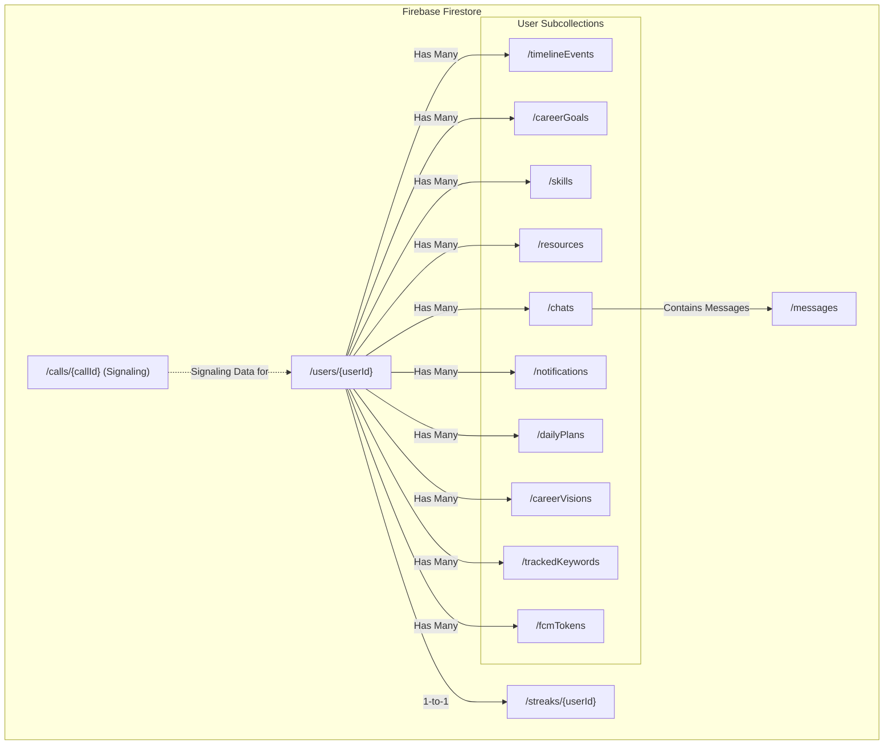

# Cloud Data Model (Firestore ERD)

This diagram illustrates the high-level Entity-Relationship structure of the Firestore database. It shows the main collections and the subcollections nested within user documents.

