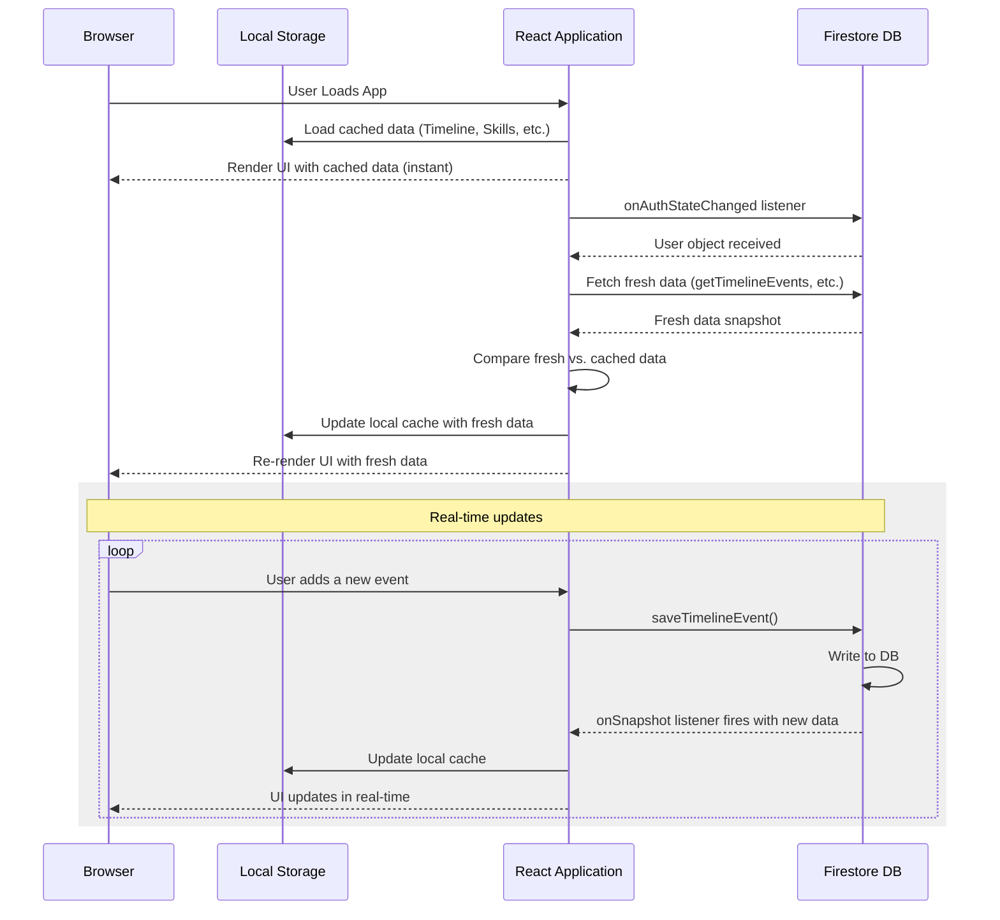

# Data Synchronization Sequence Diagram

This diagram shows the sequence of events when a user logs in, how data is hydrated from local and cloud storage, and how real-time updates are handled.

```mermaid
sequenceDiagram
    participant Client as Browser
    participant LocalStorage as Local Storage
    participant App as React Application
    participant Firestore as Firestore DB

    Client->>App: User Loads App
    App->>LocalStorage: Load cached data (Timeline, Skills, etc.)
    App-->>Client: Render UI with cached data (instant)
    
    App->>Firestore: onAuthStateChanged listener
    Firestore-->>App: User object received
    
    App->>Firestore: Fetch fresh data (getTimelineEvents, etc.)
    Firestore-->>App: Fresh data snapshot
    
    App->>App: Compare fresh vs. cached data
    App->>LocalStorage: Update local cache with fresh data
    App-->>Client: Re-render UI with fresh data
    
    rect rgb(100, 100, 100, .1)
        Note over Client, Firestore: Real-time updates
        loop
            Client->>App: User adds a new event
            App->>Firestore: saveTimelineEvent()
            Firestore->>Firestore: Write to DB
            
            Firestore-->>App: onSnapshot listener fires with new data
            App->>LocalStorage: Update local cache
            App-->>Client: UI updates in real-time
        end
    end
```
