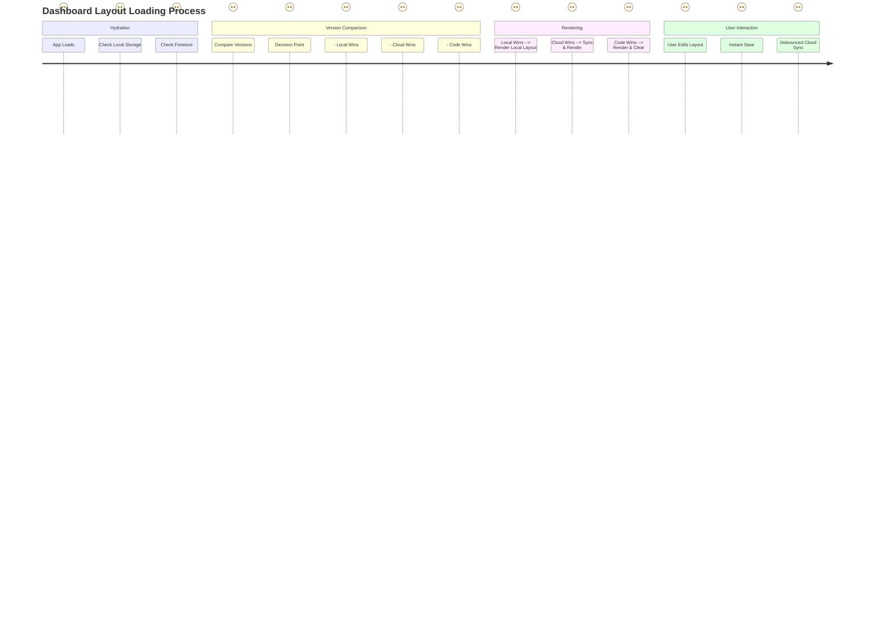

# Dashboard Layout Sync - User Journey

This diagram illustrates the journey the application takes to decide which dashboard layout to display, prioritizing user customizations while allowing for updates.

