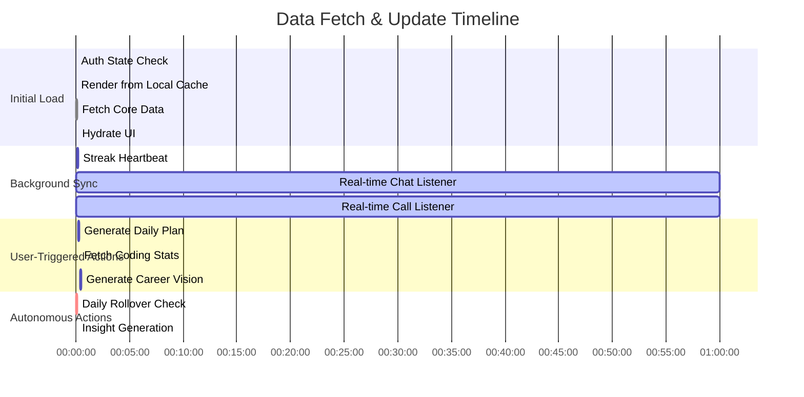

# Feature Data Update Timeline (Gantt Chart)

This Gantt chart provides a conceptual timeline for when different data-related actions occur during a typical user session.

```mermaid
gantt
    title Data Fetch & Update Timeline
    dateFormat  HH:mm:ss
    axisFormat  %H:%M:%S
    
    section Initial Load
    Auth State Check        :done, auth, 00:00:00, 1s
    Render from Local Cache :done, render_local, after auth, 1s
    Fetch Core Data         :done, fetch_core, after auth, 3s
    Hydrate UI              :done, hydrate, after fetch_core, 1s
    
    section Background Sync
    Streak Heartbeat        :active, streak, 00:00:05, 5s
    Real-time Chat Listener :active, chat, after auth, 3600s
    Real-time Call Listener :active, call, after auth, 3600s
    
    section User-Triggered Actions
    Generate Daily Plan     :plan, 00:00:10, 5s
    Fetch Coding Stats      :code, 00:00:15, 4s
    Generate Career Vision  :vision, 00:00:20, 6s
    
    section Autonomous Actions
    Daily Rollover Check    :crit, rollover, 00:00:02, 1s
    Insight Generation      :insight, after fetch_core, 3s
```
