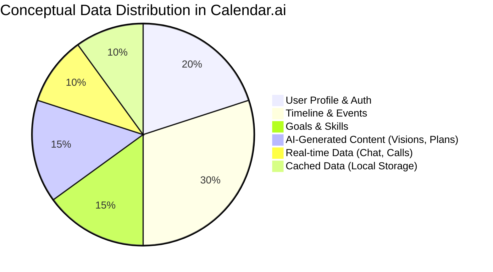

# Data Components Overview (Pie Chart)

This conceptual pie chart shows the relative "weight" or importance of different data categories within the application's architecture.

```mermaid
pie
    title Conceptual Data Distribution in Calendar.ai
    "User Profile & Auth" : 20
    "Timeline & Events" : 30
    "Goals & Skills" : 15
    "AI-Generated Content (Visions, Plans)" : 15
    "Real-time Data (Chat, Calls)" : 10
    "Cached Data (Local Storage)" : 10
```
