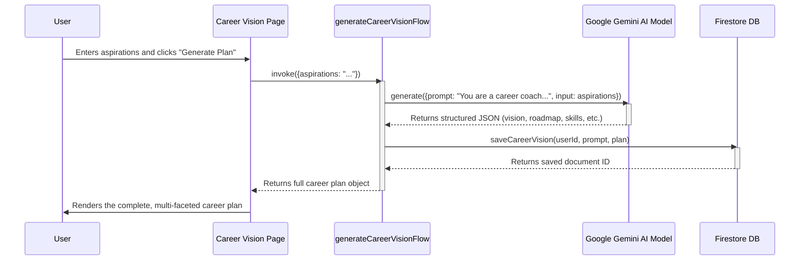

# AI Career Vision Generation Sequence Diagram

This diagram shows the sequence of events when a user generates a new AI-powered career vision plan. It illustrates the flow from the user's input on the frontend to the Genkit AI flow on the server, the call to the external Gemini model, and the final result being displayed back to the user and saved.

