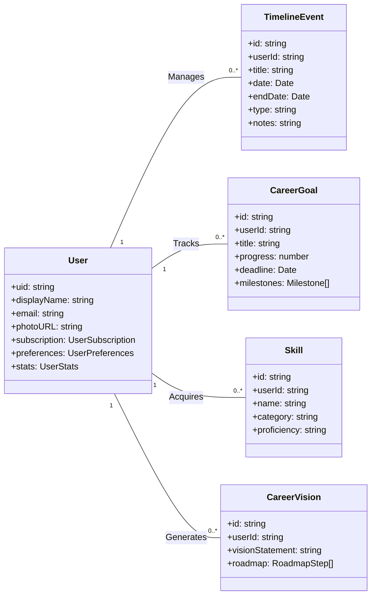

# Data Entity Class Diagram

This diagram provides a UML-style view of the primary data entities (TypeScript interfaces) used within the application. It shows the properties of each entity and their relationships, such as how a `User` has many `TimelineEvent`s and `CareerGoal`s.

