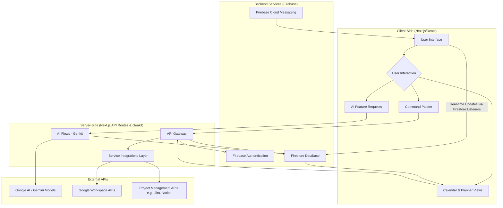
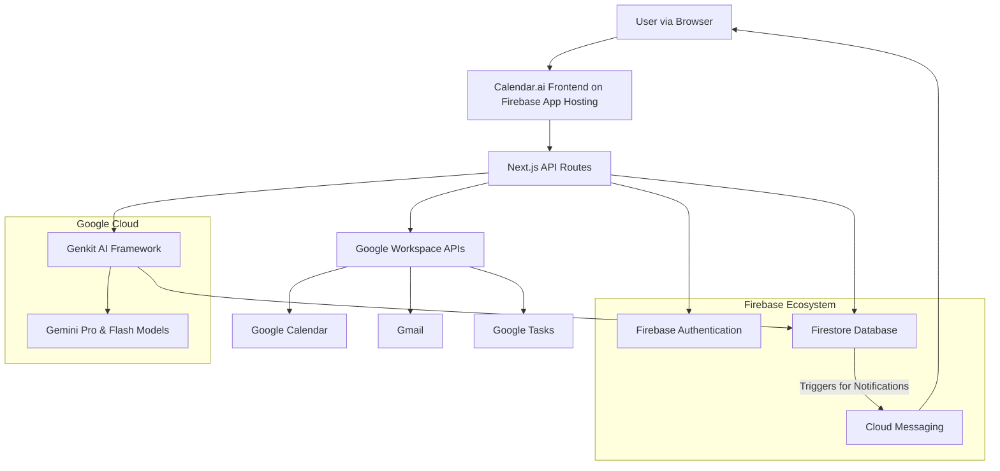
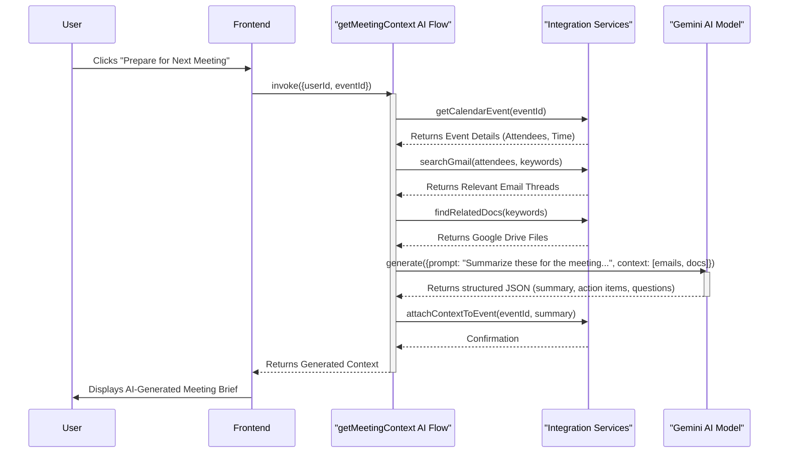

# Project Synopsis: Calendar.ai - The Intelligent Productivity Brain for Modern Teams

## 1. Introduction

In the contemporary digital-first enterprise, particularly within the fast-paced, innovation-driven technology sector, productivity has transcended its traditional definition of hours logged or tasks completed. It is now a complex, multifaceted construct, representing a delicate interplay of focus, cognitive agility, seamless collaboration, and strategic alignment. The modern knowledge worker operates within a sophisticated but dangerously fragmented digital ecosystem. Their workflow is not a linear progression but a constant, jarring traversal across a constellation of powerful, yet siloed, applications. Calendars dictate their time, cloud storage platforms like Google Drive house their critical documents, email serves as the formal artery for communication, real-time messaging applications such as Slack handle the immediate, ephemeral pulse of collaboration, and project management systems like Jira or Notion attempt to bring order to the chaos of tasks and deadlines. Each of these tools, while a masterpiece of functionality in its own right, exists as a distinct island of information. The connective tissue between these islands is fragile, entirely manual, and perilously prone to breaking under the strain of modern work demands.

This digital fragmentation imposes a heavy, often invisible, tax on productivity and innovation. An inordinate amount of a knowledge worker's day is consumed by low-value, high-friction administrative overhead. Countless hours are squandered in the frustrating hunt for the correct document version, the specific email thread mentioned in a meeting, or the critical decision buried in a rapidly scrolling chat channel. The act of scheduling and rescheduling is itself a significant time sink, a complex negotiation of availability that distracts from the substantive work it is meant to enable. At the very epicenter of this organizational chaos lies the calendar—the central nervous system of any team's temporal coordination. Yet, in its current incarnation, the digital calendar is little more than a "dumb container." It is a passive, digital ledger that dutifully records blocks of time but possesses no intelligence regarding the content, context, or priority of the events it holds. It cannot distinguish between a mission-critical project review and a casual team lunch, nor can it proactively surface the relevant information required for a productive discussion. It is a record of commitments, not a partner in achieving them.

**Calendar.ai** is engineered to dismantle this dysfunctional paradigm by fundamentally reimagining the role of the calendar in the modern workplace. Our vision is to transform this passive time grid into an AI-powered command center—an intelligent productivity brain meticulously designed for the complex needs of modern tech companies. It is architected not to replace the existing ecosystem of beloved and deeply integrated tools but to serve as a unifying, intelligent layer that weaves them together. Calendar.ai creates a single, cohesive interface where time, files, communication, and tasks are not just stored but are automatically contextualized and streamlined. Instead of being another source of fragmentation, the calendar becomes the central, intelligent hub where all facets of work converge, providing clarity and focus amidst the digital noise.

By harnessing the formidable power of advanced AI models, specifically Google's Gemini family, Calendar.ai will proactively automate the manual, cognitive-draining tasks that erode a significant portion of the workday. It will intelligently scan a user's digital footprint—with their explicit permission—to automatically find and attach relevant documents from Google Drive and critical email chains from Gmail to upcoming calendar events, ensuring every participant arrives fully briefed, prepared, and aligned. It will move beyond simple attachment, providing real-time summaries and salient talking points about shared work, both before and after meetings, to facilitate discussions that are not just shorter, but demonstrably more effective.

Crucially, Calendar.ai aims to close the notoriously inefficient and leaky loop between discussion, decision, and action. The system will be designed to process meeting outcomes—initially through structured notes and eventually through advanced, AI-powered transcript analysis—to identify, summarize, and categorize key decisions and actionable items. These identified outcomes will then be seamlessly converted into structured tasks and intelligently placed back onto the team's calendar as protected blocks of focused work time or synced directly with their preferred project management tool, such as Jira or Notion. This project is not merely about building a "smarter" calendar; it is about creating a holistic, automated, and intelligent operating system for work. It is a direct response to the systemic challenges of context switching and meeting fatigue, promising to restore focus, enhance alignment, and unlock the full innovative potential of modern teams. Calendar.ai represents a pivotal shift from passive scheduling to proactive, intelligent work orchestration.

## 2. Literature Review

The market for personal and enterprise productivity software is a mature and densely populated field, dominated by several distinct categories of tools that have fundamentally shaped modern workflows. A thorough review of this landscape reveals a persistent and significant gap in the seamless, intelligent integration between these tool categories—a gap that Calendar.ai is strategically designed to address. The existing solutions, while powerful in their respective domains, contribute to the very fragmentation that hampers true productivity.

*   **Traditional Calendaring Systems (e.g., Google Calendar, Microsoft Outlook):** These platforms are the undisputed bedrock of corporate and personal scheduling. Their core strength lies in providing a universal, visual grid for time management, enabling users to block out time and manage appointments with ease. However, their fundamental functionality has remained remarkably static for over a decade. They operate as passive, digital schedulers, entirely reliant on manual user input for every event, title, and attendee. They possess no inherent intelligence to understand the *content* or *purpose* of the events they hold. A traditional calendar cannot distinguish between a critical project deadline review and a casual team lunch. It cannot analyze a user's schedule to suggest a more optimal time for a deep work session, proactively find the relevant presentation for an upcoming meeting, or automatically generate follow-up tasks from a meeting's agenda. Their utility is confined to documenting a plan, offering no assistance in formulating, optimizing, or executing it.

*   **Project & Task Management Tools (e.g., Jira, Asana, Trello, Linear):** This category of software excels at bringing structure to work. These platforms provide powerful frameworks for organizing work into projects, boards, and lists. They are masterful at managing the "what" of productivity, with sophisticated features for assigning tasks, setting deadlines, tracking progress through various stages, and visualizing project timelines. However, they are fundamentally disconnected from the "when"—the calendar where the finite resource of time is actually allocated to perform the work. This creates a chasm between the list of tasks to be done and the available hours in the day to do them. This forces a constant, friction-filled, and manual synchronization effort between a user's task list and their calendar, a process that is not only time-consuming but also prone to gross miscalculations of available bandwidth.

*   **Real-Time Communication Hubs (e.g., Slack, Microsoft Teams):** These tools have revolutionized workplace communication, replacing slow, formal email with fast-paced, channel-based chat. While they have accelerated the speed of information flow, they have inadvertently become a primary source of context fragmentation. Critical decisions, essential files, and actionable items are often buried in rapidly scrolling channels or ephemeral direct message threads. While these platforms offer integrations to "send a message to Asana" or "create a Google Calendar event," these are manual, user-triggered actions that require discipline and effort. The context does not flow automatically or intelligently from the conversation to the corresponding project or calendar event. The burden of remembering to capture and transfer this information remains squarely on the user, leading to lost action items and a breakdown in team alignment.

*   **All-in-One Workspaces & Document Editors (e.g., Notion, Coda, Google Docs):** This category represents a paradigm shift towards flexibility, providing powerful, database-driven environments (Notion, Coda) or collaborative documents (Google Docs) where teams can build their own bespoke workflows and store information. Their "blank canvas" approach is their greatest strength and most significant weakness. For technically proficient teams willing to invest considerable time, they can be molded into powerful custom systems. However, they are not inherently proactive or automated. The intelligence must be manually built by the user through complex database relations and integrations. They do not automatically scan a user's email to surface relevant information for a meeting or analyze a team's schedule to identify and protect time for deep work without extensive, user-created automation. They are powerful tools for knowledge storage, but they do not actively manage or optimize the workflow itself.

Calendar.ai’s unique proposition is not to replace these established and beloved tools, but to serve as the **intelligent, connective tissue** between them. It aims to unify this fragmented landscape by using the calendar as the central context hub. By leveraging AI to automate the flow of information between the places where work is discussed (Slack, Email), planned (Jira, Asana), and executed (Google Docs), Calendar.ai creates a system that is more than the sum of its parts, addressing a critical, unmet need in the modern productivity software market.

## 3. Objectives

The primary objectives of the Calendar.ai project are meticulously defined to address the systemic fragmentation of modern work and to pioneer a new category of productivity software that is proactive, context-aware, and intelligent. These objectives form the guiding principles for the development process and articulate the core value proposition of the application.

1.  **To Establish a Unified Command Center for Work:** The foremost objective is to develop a single, cohesive interface that intelligently connects the four pillars of modern work: **time** (the calendar), **files** (cloud storage like Google Drive), **communication** (email and chat), and **tasks** (project management tools). The goal is to eliminate the severe cognitive load and time wastage caused by employees having to constantly switch between disparate applications. By creating a central hub where all work-related context converges around a user's schedule, Calendar.ai will provide a holistic, at-a-glance view of their commitments and the resources needed to fulfill them, thereby transforming the calendar from a simple scheduler into a true command center.

2.  **To Implement Proactive and Automated Contextual Intelligence:** Calendar.ai will fundamentally move beyond the paradigm of passive scheduling. A core objective is to build and refine a "Model Context Protocol" (MCP) that automatically gathers and attaches relevant context to calendar events. This involves developing sophisticated AI flows that can securely access and analyze a user's email (Gmail), file systems (Google Drive), and communication channels (Slack). The system will be able to identify and link the correct presentation deck, the relevant email thread, or the specific design document to an upcoming meeting, ensuring that all participants arrive fully prepared and aligned, thus making meetings shorter and more effective.

3.  **To Automate the Generation of Actionable Outcomes:** A critical failure point in modern workflows is the gap between discussion and execution. A primary objective of Calendar.ai is to automate the capture and conversion of meeting outcomes into tangible tasks. The system will be designed to process meeting data—initially through structured notes and eventually through advanced AI-powered transcript analysis—to identify, summarize, and categorize key decisions and action items. It will then go a step further by automatically creating structured tasks and intelligently placing them within the user's preferred project management tool (e.g., Jira, Notion) or scheduling them directly back onto their calendar as focused work blocks.

4.  **To Enable Intelligent Scheduling and Proactive Time Optimization:** The project aims to imbue the calendar with a deep understanding of work priorities, team capacity, and individual focus-time preferences. The AI will be tasked with analyzing team schedules, project deadlines from integrated tools, and user-defined preferences to offer intelligent scheduling suggestions. This includes identifying the most optimal time for a cross-functional meeting to minimize disruption, automatically protecting and scheduling blocks of "deep work" time for engineers and creatives, and proactively highlighting potential scheduling conflicts or risks of employee burnout based on calendar density and workload.

5.  **To Provide Data-Driven Productivity Insights and Analytics:** By serving as the central hub that connects all facets of work, Calendar.ai will be uniquely positioned to generate invaluable, objective analytics on how time—a company's most precious resource—is actually spent. A key objective is to build clear, intuitive dashboards that provide leadership with data-driven insights. These analytics will answer critical questions: "What is the true cost of our weekly sync meetings?", "How much time is our engineering team spending in meetings versus focused development?", and "Where are the most significant cross-team collaboration bottlenecks?". These insights will empower organizations to make informed, strategic decisions to improve overall operational efficiency and employee well-being.

## 4. Problem Statement

Modern technology companies, despite being at the forefront of digital innovation, are facing a severe and escalating productivity crisis. This crisis is not born from a lack of tools, but from a surplus of them. The contemporary workflow is dangerously fragmented, scattered across a constellation of disconnected, specialized applications. An engineer's day, for instance, is a jarring sequence of context switches: a calendar for scheduling, Google Drive for technical design documents, email for formal announcements, Slack for real-time problem-solving, and a tool like Jira for tracking tickets. Each platform is a locked silo of information. This digital fragmentation forces employees to spend an inordinate amount of time and cognitive energy on low-value, administrative tasks: manually scheduling and rescheduling meetings, hunting for the right file or email thread before a call, and repeating the same discussions because critical context was lost in a fast-moving chat channel.

At the heart of this systemic inefficiency is the digital calendar, which, in its current form, is fundamentally broken as a productivity tool. It operates as a “dumb container of time.” It can tell you *when* you need to be somewhere, but it has no understanding of *why* that meeting is important, *what* documents are relevant to it, or *what* actions should follow from it. It lacks any intelligence regarding team priorities, individual workload balance, or organizational goals. Files and emails remain tragically disconnected from the calendar events they relate to, forcing employees to manually bridge these contextual gaps before every single meeting. This constant, manual re-assembly of context is a massive drain on focus and creative energy.

The consequences of this fragmented workflow are profound and costly. It leads to a perpetual state of reactive work, where the urgent consistently tramples the important. Decisions and action items generated during meetings are frequently lost, failing to flow back into project management tools or individual schedules automatically. This broken feedback loop results in project delays, team misalignment, and duplicated effort. Furthermore, the relentless cycle of back-to-back, poorly contextualized meetings is a primary driver of meeting fatigue and employee burnout, which are significant threats to talent retention and overall organizational health. Tech teams are drowning in a sea of information without the tools to navigate it effectively. Without an intelligent system that unifies scheduling, file management, communication, and actionable feedback, companies are struggling to maintain efficiency, strategic alignment, and the very focus required for deep, innovative work.

## 5. Proposed Method

The Calendar.ai application is conceptualized and will be built upon a modern, full-stack architecture that is meticulously designed for intelligence, scalability, and a rich, responsive user experience. The core methodology is centered around a "Model Context Protocol" (MCP), a strategic approach ensuring that all AI-driven features are not generic, but are instead deeply personalized and contextually aware of the user's and the team's specific work environment. This protocol is the foundational philosophy that guides the entire technical implementation.

1.  **Technology Stack:** The application will be built using a robust, type-safe, and modern technology stack, chosen specifically for its performance, developer experience, and inherent scalability, which are critical for an enterprise-grade SaaS product.
    *   **Frontend:** The user interface will be developed with **Next.js**, leveraging **React** and **TypeScript**. This choice enables a highly interactive, component-based architecture with the benefits of server-side rendering for fast initial load times and client-side navigation for a fluid, app-like feel. TypeScript will be enforced across the entire codebase to ensure type safety, which dramatically reduces runtime errors and improves long-term maintainability.
    *   **Styling:** A utility-first CSS approach with **Tailwind CSS** will be used for rapid and consistent UI development. This will be complemented by a curated library of components from **ShadCN UI**, which provides a set of beautifully designed, accessible, and reusable primitives, ensuring a professional and polished aesthetic out-of-the-box.
    *   **Backend & Database:** The entire backend infrastructure will be powered by the **Firebase ecosystem**, chosen for its seamless integration and real-time capabilities. **Firestore** will serve as the primary NoSQL database, storing all user data, tasks, and system state in a scalable, real-time-synced manner. **Firebase Authentication** will provide secure, multi-provider user management (including email/password and Google OAuth).
    *   **AI Framework:** All generative AI features will be architected using **Google's Genkit framework**. Genkit is an open-source, robust framework designed to structure, manage, and deploy reliable AI "flows." This allows for the creation of maintainable and testable AI logic that connects to Google's powerful **Gemini** family of models, ensuring that all AI inputs and outputs are strongly typed and predictable.

2.  **Model Context Protocol (MCP) Implementation:** The application's core intelligence is achieved through the MCP. This is not a single component, but a strategic, multi-stage process that occurs before any call is made to a generative AI model. When a user requests an AI-driven task (e.g., "prepare me for my next meeting"), the system will execute a context-gathering sequence. This sequence involves:
    *   Fetching the calendar event's details: title, attendees, time, and any existing description.
    *   Querying the Gmail API for relevant email threads involving the meeting's attendees and keywords from the title.
    *   Searching Google Drive for documents (Docs, Sheets, Slides) that are owned by or have been shared with the attendees and match the meeting's context.
    *   Retrieving related tasks or tickets from a connected project management tool (like Jira or Notion) by cross-referencing attendees and project identifiers.
    *   This comprehensive "context package" is then dynamically injected into a structured, role-based prompt. This enables the Gemini model to act not as a generic language model, but as a deeply informed assistant that can provide accurate summaries, identify relevant action items, and generate insightful talking points based on a rich, multi-faceted understanding of the work at hand.

3.  **Data Synchronization and Secure Integrations:** To serve as a central, unifying hub, the system is architected for seamless and secure integration with external enterprise services. It will use the industry-standard **OAuth 2.0** protocol to securely connect to Google Workspace APIs (Calendar, Tasks, Gmail). Dedicated, server-side services will be responsible for fetching data from these platforms. This data will then be processed through AI flows to extract actionable insights—for example, converting an email about a project deadline into a timeline event or syncing assigned tasks from a project board onto an individual's calendar—before being securely stored in the user's dedicated Firestore documents.

4.  **Extensible and Modular Architecture:** Recognizing that every organization's toolchain is unique, the application will be designed with a modular plugin architecture. Each third-party integration (e.g., Jira, Slack, Notion) will be developed as a self-contained module with its own authentication flow, data-fetching logic, and UI components. A central service, managed in Firestore, will handle the state of installed and configured plugins for each user or organization. The main application UI will then dynamically render components and trigger workflows from these different extensions, ensuring a maintainable and future-proof design that can evolve to support a wide array of enterprise tools.

## 6. Block Diagram

## 7. System Architecture Diagrams

### High-Level System Architecture

### AI Context-Attachment Flow (MCP Implementation)

## 8. Conclusion

Calendar.ai represents a fundamental and necessary evolution in the domain of productivity software. It moves decisively beyond the passive, "dumb container" paradigm that has long defined traditional calendar and task management applications. By architecting a symbiotic and intelligent relationship between the user and a powerful AI assistant, the project directly confronts the core problem of digital fragmentation that plagues modern workplaces. The proposed architecture, which is centered around the "Model Context Protocol" (MCP), is the cornerstone of this innovation. This protocol ensures that the AI's guidance is not generic or superficial, but is instead deeply personalized, contextually relevant, and, most importantly, immediately actionable. The success of Calendar.ai hinges on its ability to drastically reduce the cognitive friction inherent in strategic, cross-platform work. It achieves this by unifying disparate streams of information, automating the cognitively demanding process of context-gathering and planning, and forging a clear, motivating through-line between high-level discussions and concrete execution.

The initial implementation, which focuses on deeply integrating Google Workspace data and leveraging AI for intelligent planning and summarization, serves as a robust and compelling proof-of-concept for this ambitious vision. It validates the core hypothesis that by providing an AI with rich, cross-platform context, we can unlock a new echelon of productivity and mitigate the digital friction that hampers knowledge workers. The extensible plugin architecture ensures that Calendar.ai is not a closed system but a future-proof platform, capable of growing to encompass the full, diverse ecosystem of enterprise tools. Ultimately, this project is not merely about building a better calendar; it is about creating an intelligent, automated operating system for work that closes the critical loop between discussion, decision, and action. By doing so, Calendar.ai will free up teams to dedicate their most valuable resources—their time, focus, and creativity—to their most impactful and innovative work, thereby driving both individual and organizational success.

## 9. References

[1] G. Mark, D. Gudith and U. Klocke, "The Cost of Interrupted Work: More Speed and Stress," *Proceedings of the SIGCHI Conference on Human Factors in Computing Systems*, 2008.

[2] D. J. Levitin, *The Organized Mind: Thinking Straight in the Age of Information Overload*. Penguin Books, 2015.

[3] T. Horvath, "A Detailed Model of the Effects of Interruption on Task Performance," *International Journal of Human-Computer Studies*, vol. 53, 2000.

[4] D. Allen, *Getting Things Done: The Art of Stress-Free Productivity*. Penguin Books, 2001.

[5] S. Whittaker, V. Bellotti and J. Gwizdka, "Email in a Global World: A Case Study of Overload," *ACM Transactions on Computer-Human Interaction*, vol. 13, no. 2, 2006.

[6] J. Grudin, "Why CSCW applications fail: problems in the design and evaluation of organizational interfaces," *Proceedings of the 1988 ACM conference on Computer-supported cooperative work*, 1988.

[7] A. Nenkova and K. McKeown, "A Survey of Text Summarization Techniques," in *Mining Text Data*, Springer, 2012.

[8] D. A. Norman, *The Design of Everyday Things*. Basic Books, 2013.

[9] D. T. V. Le, W. B. Dolan, and C. Quirk, "Task-Completion-Platform-Based Models for Task-Oriented Dialogue," in *Proceedings of the 2021 Conference of the North American Chapter of the Association for Computational Linguistics*, 2021.

[10] B. A. Nardi, *Context and Consciousness: Activity Theory and Human-Computer Interaction*. MIT Press, 1996.

## 10. LINKS

*   **Live Prototype:** [http://futuresight-8ebba4468907.herokuapp.com](http://futuresight-8ebba4468907.herokuapp.com)
*   **Project Repository:** [https://github.com/AshishYesale7/FutureSight](https://github.com/AshishYesale7/FutureSight)
