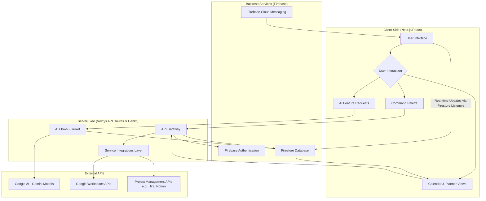
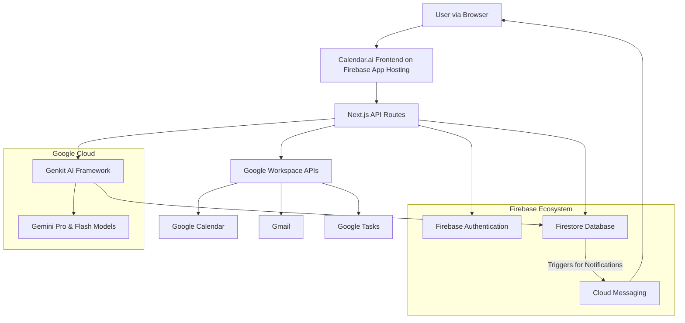
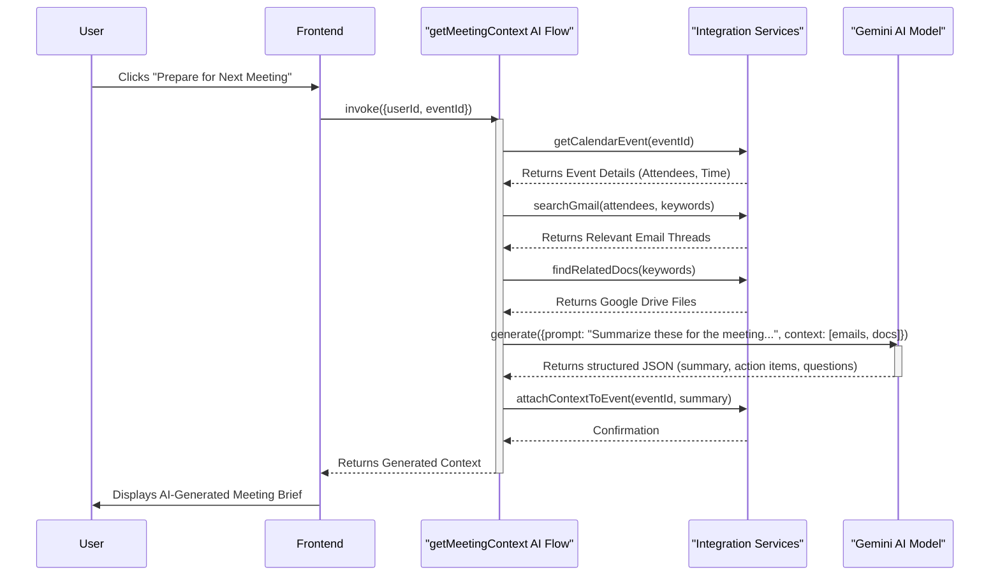

# Project Synopsis: Calendar.ai - The Intelligent Productivity Brain

## 1. Introduction

In modern tech companies, productivity is suffering from a fundamental fragmentation of work. Employees and teams are forced to navigate a scattered landscape of disconnected tools: calendars for scheduling, Google Drive for documents, email for communication, Slack for real-time chat, and project management platforms for tasks. This digital friction extracts a heavy toll. Countless hours are lost to the administrative overhead of scheduling and rescheduling, hunting for the correct file or email thread, and repeating discussions because critical context is siloed and inaccessible when it's needed most. Today's digital calendars, the central nervous system of any organization's time, are little more than "dumb containers." They passively hold blocks of time but lack any intelligence regarding priorities, team workload, or the very purpose of the meetings they contain.

**Calendar.ai** is engineered to solve this problem by transforming the calendar from a passive time grid into an AI-powered command center. Our vision is to create an intelligent productivity brain for modern companies that deeply integrates with the existing ecosystem of tools (Google Workspace, Slack, Jira, Notion) to unify time, files, communication, and tasks. Instead of being a source of fragmentation, the calendar becomes the central hub where work is automatically contextualized and streamlined. By leveraging advanced AI, Calendar.ai will automatically attach relevant files to events, summarize email chains before a meeting, convert discussion outcomes into actionable tasks, and provide data-driven insights into how teams can optimize their most valuable resource: their time. This project closes the inefficient loop from meeting to decision to action, promising to reduce meeting fatigue, eliminate constant context switching, and foster smarter, more aligned, and more productive teams.

## 2. Literature Review

The productivity software market is dominated by several mature categories of tools, yet a significant gap exists in the seamless, intelligent integration between them, a gap that Calendar.ai aims to fill.

*   **Traditional Calendaring Systems (e.g., Google Calendar, Microsoft Outlook):** These platforms are the bedrock of corporate scheduling. Their strength is providing a universal, visual grid for time management. However, their core functionality has stagnated; they remain passive systems that are entirely dependent on manual user input. They lack the intelligence to understand the *content* or *purpose* of the events they hold. They cannot suggest a better meeting time based on team workload, find relevant documents for an upcoming discussion, or automatically create follow-up tasks from a meeting's agenda. They are digital schedulers, not productivity partners.

*   **Project & Task Management Tools (e.g., Jira, Asana, Trello):** These platforms excel at organizing work into structured projects, boards, and lists. They manage the "what" of productivity with powerful features for assigning tasks, setting deadlines, and tracking progress. However, they are fundamentally disconnected from the "when"—the calendar where time is actually allocated to perform the work. This forces a constant, manual synchronization effort between the task list and the calendar, leading to discrepancies, outdated plans, and a failure to realistically budget time for assigned work.

*   **Communication Hubs (e.g., Slack, Microsoft Teams):** These tools have revolutionized real-time communication, but they have also become a primary source of context fragmentation. Important decisions, files, and action items are often buried in fast-moving channels and direct message threads. While integrations exist to "send a message to Asana," these are manual, user-triggered actions. The context does not flow automatically or intelligently from the conversation to the corresponding project or calendar event, leaving it up to individuals to remember and transfer information.

*   **All-in-One Workspaces (e.g., Notion, Coda):** These flexible platforms offer powerful, database-driven environments that allow teams to build custom workflows. While incredibly capable, their "blank canvas" approach requires a significant upfront investment in system design and maintenance. More importantly, they are not inherently proactive. The intelligence must be manually built by the user. They do not automatically scan a user's email to surface relevant information for a meeting or optimize a team's schedule for deep work without extensive, user-created automation.

Calendar.ai’s unique proposition is to serve as the intelligent, connective tissue between these siloed systems. It will not replace them but rather unify them, using the calendar as the central context hub and leveraging AI to automate the flow of information between where work is discussed, planned, and executed.

## 3. Objectives

The primary objectives of Calendar.ai are designed to directly address the fragmentation of modern work and transform the calendar into a proactive, intelligent system.

1.  **To Create a Unified Command Center:** The foremost objective is to develop a single interface that intelligently connects time (calendar), files (drive), communication (email), and tasks (project management tools). This will eliminate the need for employees to constantly switch between applications, reducing cognitive load and providing a holistic view of their work.

2.  **To Implement Proactive Contextual Intelligence:** Calendar.ai will move beyond passive scheduling by automatically attaching relevant context to calendar events. This involves developing AI flows that can scan a user's email and file systems to find and link documents, presentations, and discussions pertinent to an upcoming meeting, ensuring all participants arrive prepared.

3.  **To Automate Actionable Outcomes:** A core goal is to close the loop between discussion and execution. The system will be designed to process meeting discussions (initially through notes, eventually through transcripts) to identify and summarize key decisions and action items. It will then automatically convert these into structured tasks and place them within the user's preferred project management tool or back onto their calendar.

4.  **To Enable Intelligent Scheduling & Time Optimization:** The project aims to imbue the calendar with an understanding of priorities and workload. The AI will analyze team schedules, project deadlines, and individual focus-time preferences to suggest more efficient meeting schedules, protect blocks of time for deep work, and highlight scheduling conflicts or potential burnout risks.

5.  **To Provide Data-Driven Productivity Insights:** By serving as the central hub for work, Calendar.ai will be uniquely positioned to generate valuable analytics. The objective is to build dashboards that provide clear, data-driven insights into how teams and individuals spend their time, where bottlenecks occur, and what the true cost of meetings is, enabling leaders to make informed decisions to improve overall productivity.

## 4. Problem Statement

Tech companies today face a major productivity challenge: their work is scattered across disconnected tools like calendars, Google Drive, email, and chat platforms. Employees spend countless hours scheduling and rescheduling meetings, searching for the right files, and repeating the same discussions because important context is siloed. Meetings generate decisions and action items, but these rarely flow back into tasks or schedules automatically, creating inefficiency and wasted effort.

Calendars in their current form are essentially “dumb containers of time.” They do little more than hold events, with no intelligence around prioritization, workload management, or productivity optimization. Files and emails remain detached from the meetings they belong to, forcing employees to manually connect the dots. The result is constant context switching, meeting fatigue, and a lack of visibility into who decided what and where the latest work lives.

This fragmented workflow costs tech teams not just time but also clarity. Without an intelligent system that unifies scheduling, file management, communication, and feedback, companies struggle to maintain efficiency, alignment, and focus.

## 5. Proposed Method

The Calendar.ai application is architected as a modern, full-stack web application designed for intelligence, scalability, and a responsive user experience. The methodology is centered around a "Model Context Protocol" (MCP), a strategy to ensure all AI features are deeply personalized and contextually aware.

1.  **Technology Stack:** The application is built using a robust, type-safe technology stack chosen for its performance and scalability.
    *   **Frontend:** The user interface is developed with **Next.js**, leveraging **React** and **TypeScript**. This enables a highly interactive, component-based UI with the benefits of server-side rendering for performance.
    *   **Styling:** A utility-first approach with **Tailwind CSS** is used for rapid UI development, complemented by **ShadCN UI** for a consistent and professional component library.
    *   **Backend & Database:** The backend infrastructure is powered by the **Firebase ecosystem**. **Firestore** serves as the real-time NoSQL database for storing user data, tasks, and system state. **Firebase Authentication** provides secure, multi-provider user management.
    *   **AI Framework:** **Google's Genkit** is the core framework for all generative AI features. It is used to structure, manage, and deploy reliable AI "flows" that connect to Google's **Gemini** models, ensuring structured and predictable outputs.

2.  **Model Context Protocol (MCP) Implementation:** The application's intelligence is achieved through the MCP. This is a strategic, pre-processing step that occurs before any call is made to a generative AI model. When an AI-driven task is requested (e.g., "prepare for my next meeting"), the system gathers a comprehensive context package. This package includes:
    *   The calendar event's details (title, attendees, time).
    *   Relevant emails fetched via the Gmail API, filtered by attendees and keywords.
    *   Linked documents from Google Drive.
    *   Related tasks from a connected project management tool.
    *   This rich context package is then dynamically injected into a structured AI prompt, enabling the Gemini model to act not as a generic tool, but as a deeply informed assistant that can provide summaries, identify action items, and generate relevant talking points.

3.  **Data Synchronization and Integrations:** To serve as a central hub, the system is designed for seamless, secure integration with external services. It uses **OAuth 2.0** to connect to Google Workspace APIs (Calendar, Tasks, Gmail). Dedicated services are responsible for fetching data from these platforms and using AI flows to process and synchronize it into the user's Calendar.ai timeline, converting emails about deadlines into events or syncing tasks from a project board.

4.  **Extensible Architecture:** The application is designed with a modular plugin architecture to ensure it can evolve. Each integration (e.g., Jira, Slack) is a self-contained module with its own logic. A central service manages the state of installed plugins for each user, allowing the main application to dynamically render UI and trigger workflows from different extensions, ensuring a maintainable and future-proof design.

## 6. Block Diagram

## 7. System Architecture Diagrams

### High-Level System Architecture

### AI Context-Attachment Flow (MCP Implementation)

## 8. Conclusion

Calendar.ai represents a fundamental rethinking of the role of the calendar in the modern workplace. By rejecting the passive "dumb container" paradigm, we propose a system that is proactive, intelligent, and deeply integrated into the fabric of a team's workflow. The architectural foundation, built on a modern serverless stack and centered around our "Model Context Protocol," is designed to be both powerful and extensible. It transforms the calendar into a dynamic surface that doesn't just show what's next, but actively helps teams prepare for it, act on it, and learn from it.

The initial implementation, which focuses on integrating Google Workspace data and leveraging AI for planning and summarization, serves as a robust proof-of-concept for this vision. It validates the core hypothesis that by providing an AI with rich, cross-platform context, we can unlock a new level of productivity and reduce the digital friction that plagues knowledge workers. The extensible plugin architecture ensures that Calendar.ai is future-proof, capable of growing to encompass the full ecosystem of enterprise tools. Ultimately, this project is not just about building a better calendar; it's about creating an intelligent, automated system that closes the loop between discussion, decision, and action, thereby freeing up teams to focus on their most impactful work.

## 9. References

*   **Next.js Documentation:** [https://nextjs.org/docs](https://nextjs.org/docs) - Official documentation for the React framework used.
*   **Firebase Documentation:** [https://firebase.google.com/docs](https://firebase.google.com/docs) - Comprehensive documentation for the backend services platform.
*   **Google AI & Genkit:** [https://developers.google.com/ai](https://developers.google.com/ai) - Documentation for Google's Generative AI models and the Genkit framework.
*   **Google Workspace APIs:** [https://developers.google.com/workspace](https://developers.google.com/workspace) - API documentation for Calendar, Gmail, Drive, etc.
*   **Norman, D. A. (1988). *The Design of Everyday Things*. Basic Books.** - Foundational principles for user-centric, intuitive design that inform the application's UX.

## 10. LINKS

*   **Live Prototype:** [http://futuresight-8ebba4468907.herokuapp.com](http://futuresight-8ebba4468907.herokuapp.com)
*   **Project Repository:** [https://github.com/AshishYesale7/FutureSight](https://github.com/AshishYesale7/FutureSight)
