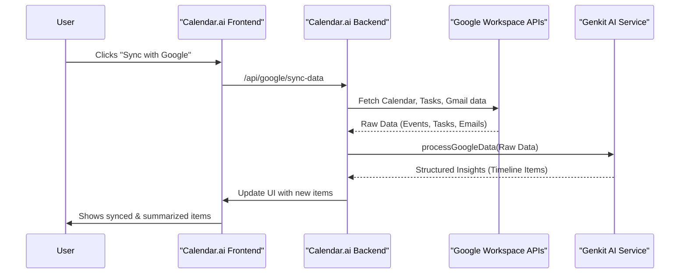
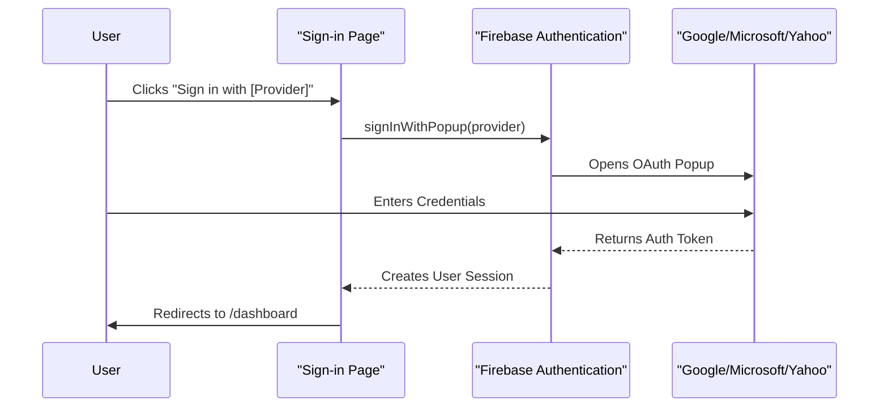
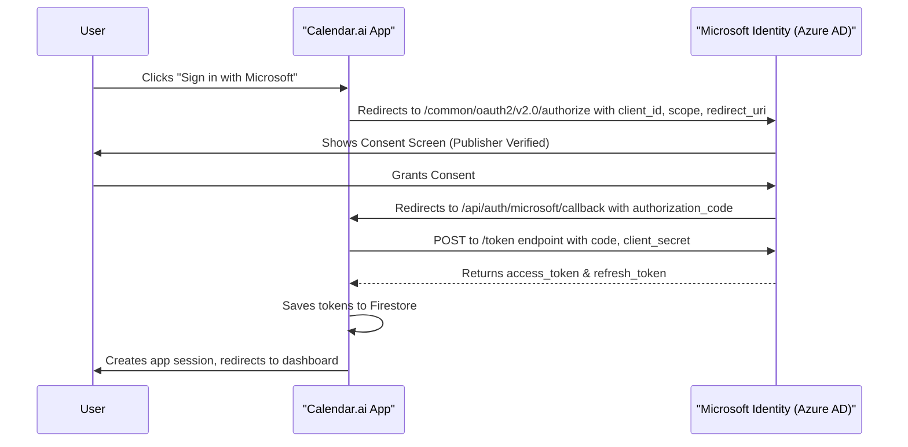
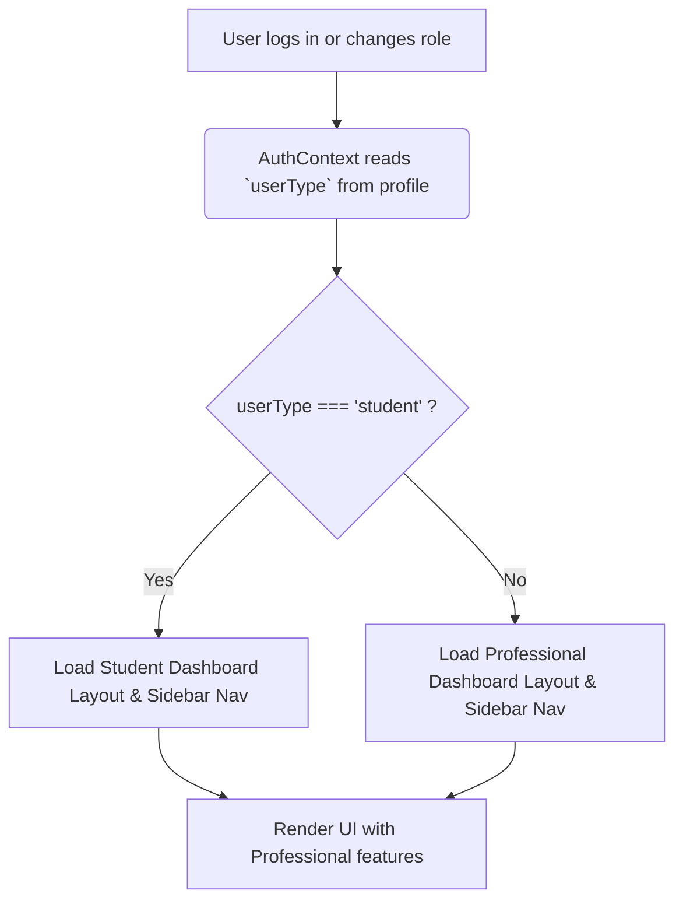
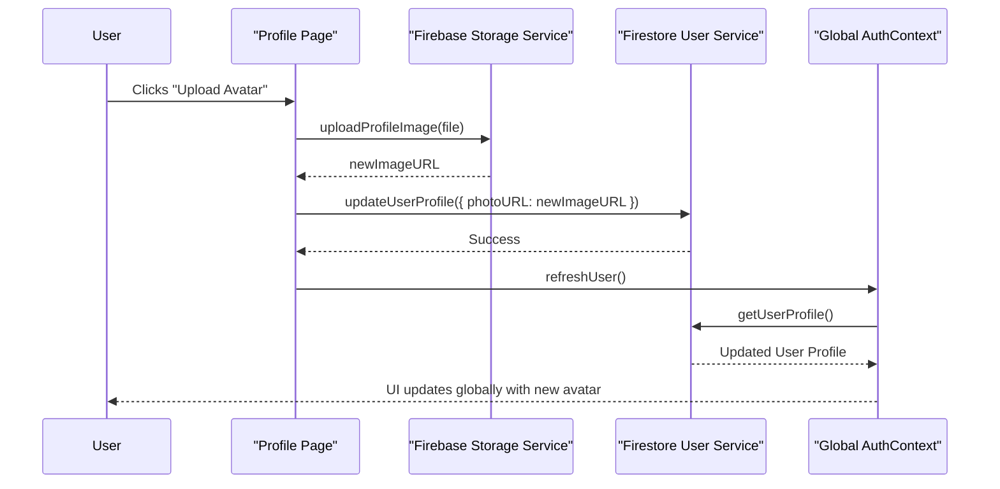
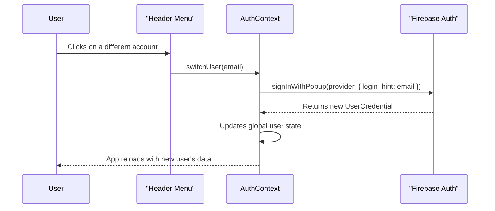
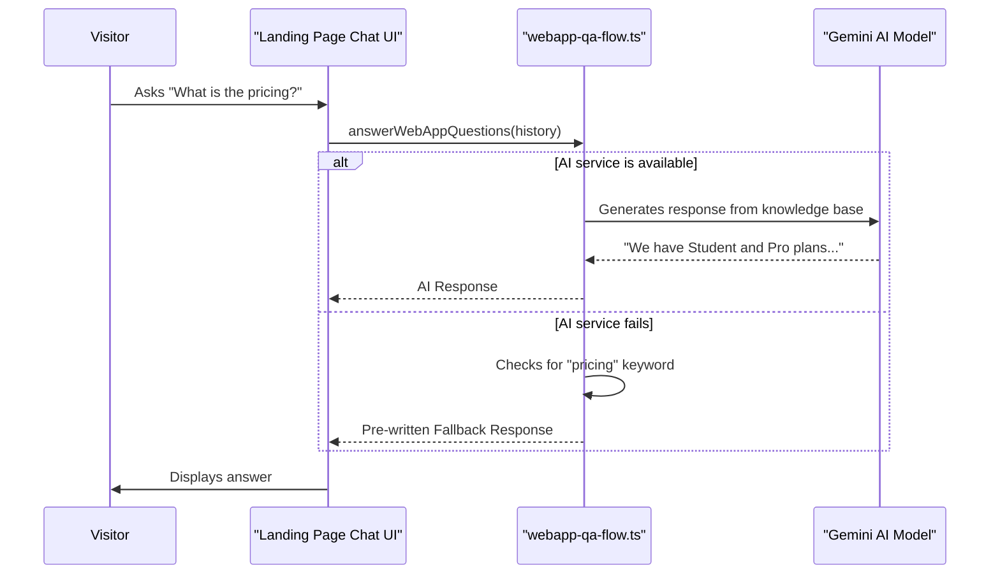
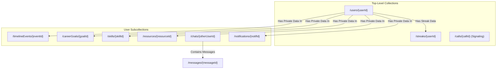

---

# **Comprehensive Product Update Catalog**

## **1. Comprehensive Data Synchronization**

### **Summary**

Implemented a complete backend synchronization pipeline integrating Google services (Calendar, Tasks, Gmail) with AI-driven data processing and contextualization.

### **Core Functionality**

* Integrated Google OAuth for user authentication and secure access to Google APIs.
* Synced Google Calendar, Gmail, and Tasks in real-time.
* Designed AI models to summarize important emails and automatically convert relevant tasks or events into actionable timeline items.

### **UI Enhancements**

* Introduced timeline-based visualization for synced events and tasks.
* Created user-centric data cards to display summarized email insights.

### **Architecture Diagram**



---

## **2. Customizable Widget Dashboard**

### **Summary**

Replaced the static dashboard with a responsive, customizable grid system supporting role-based layouts and persistent personalization.

### **Core Functionality**

* Integrated `react-grid-layout` for dynamic widget placement and resizing.
* Added full edit mode allowing drag, resize, hide, and show operations.
* Implemented version-controlled layout synchronization between local storage and Firestore.

### **Architecture Diagram**

```mermaid
graph TD
    A[User Enters Edit Mode] --> B{Drags & Resizes Widgets};
    B --> C[Layout changes stored in React state];
    C --> D{Debounced Save};
    D --> E[Save to Local Storage (Instant)];
    D --> F[Save to Firestore (Cloud Sync)];

    subgraph "On App Load"
        G[AuthContext determines user role] --> H{Load Layouts};
        H -- "1. Check Local Storage" --> I[Local Layout];
        H -- "2. Check Firestore" --> J[Cloud Layout];
        H -- "3. Use Default" --> K[Code Default Layout];
        I & J & K --> L[Select Newest Version];
        L --> M[Render Dashboard];
    end
```

---

## **3. Floating AI Command Bar (Desktop)**

### **Summary**

Implemented an interactive, floating AI-powered command bar designed as the central control and interaction point for the desktop application.

### **Core Functionality**

* Functions as both a quick launcher and full-screen AI workspace.
* Integrates AI chat, file browser, and terminal interfaces.
* Accessible via keyboard shortcuts (Ctrl/Cmd + K).

### **UI Enhancements**

* Glassmorphic design with animated, multi-color borders.
* Draggable and position-aware bar with persistent placement memory.
* Smooth open/close animations using Framer Motion.

### **Architecture Diagram**

```mermaid
graph TD
    subgraph "User Interaction"
        A[Keyboard Shortcut (Ctrl+K)]
        B[Click on Bar]
    end

    subgraph "Component State (Framer Motion)"
        C{isOpen: boolean}
        D{isFullScreen: boolean}
        E[position: {x, y}]
    end

    subgraph "Render Logic"
        F[DesktopCommandBar.tsx]
        G[AiAssistantChat.tsx]
        H[ChatBody, FileSystemBody, etc.]
    end

    A --> C;
    B --> C;
    F -- Reads State --> C & D & E;
    F -- Renders --> G;
    G -- Renders --> H;
```

---

## **4. Public Pages & Onboarding Enhancements**

### **Summary**

Redesigned all public-facing and authentication pages for a modern, cohesive, and interactive user experience, adding multiple authentication providers.

### **Core Functionality**

* Rebuilt landing, sign-up, and sign-in pages with animation and multi-provider authentication.
* Implemented a guided onboarding flow for initial profile setup and role selection (Student/Professional).
* Added OAuth integrations for **Google, Microsoft, Yahoo**, and phone-based OTP authentication via Firebase.

### **Authentication Flow Diagram**


---

## **5. Microsoft Authentication Integration & Azure Debugging**

### **Summary**

Added support for Microsoft personal and work accounts via OAuth, ensuring enterprise-ready login flexibility.

### **Core Functionality**

*   Integrated Microsoft's v2.0 OAuth endpoints using the `/common` tenant to support both personal (Outlook.com) and work/school (Azure AD) accounts.
*   Securely configured the Client ID and Client Secret via environment variables.

### **Debugging**

*   **Fixed Unverified Publisher Warning:** Resolved the "unverified publisher" warning on the Microsoft consent screen by hosting the `microsoft-identity-association.json` file in the `/.well-known` directory of our domain, proving ownership to Azure.
*   **Corrected Callback URI Mismatch:** Ensured the `redirect_uri` sent in the OAuth request exactly matched the one registered in the Azure App Registration portal to prevent authentication failures after user sign-in.
*   **Enabled Personal & Work Accounts:** Switched to the `/common` tenant endpoint to allow both personal Microsoft accounts and work/school accounts to authenticate, broadening user accessibility.

### **Architecture Diagram**



---

## **6. Student vs. Professional Role Architecture**

### **Summary**

Introduced dynamic application modes tailored for Students and Professionals, optimizing dashboard content and navigation based on user role.

### **Architecture Diagram**



---

## **7. Avatar System Implementation**

### **Summary**

Developed a centralized avatar system enabling personalized identity management across the platform, with options for selection during onboarding and custom uploads.

### **Architecture Diagram**


---

## **8. Multi-Account Management**

### **Summary**

Built a seamless multi-account system enabling users to manage and switch between multiple authenticated profiles efficiently within the header menu.

### **Architecture Diagram**


---

## **9. Landing Page AI Chatbot**

### **Summary**

Deployed an AI-powered Q&A chatbot on the landing page, supplemented by immersive video and animation backgrounds.

### **Architecture Diagram**



---

# **Technical Implementation Summary**

## **1. Core Frameworks & Libraries**

*   **Next.js & React:** The application is built on **Next.js 15** with **React 18**, utilizing the App Router for a modern, server-centric, and performant architecture.
*   **Genkit:** All AI-powered features, from the Career Vision Planner to email summarization, are built using Google's **Genkit**, an open-source framework for creating robust, maintainable, and observable AI flows.
*   **WebRTC:** The real-time audio and video calling suite is built directly on the **WebRTC** protocol, enabling secure, peer-to-peer media streaming and minimizing server overhead.
*   **UI & Styling:**
    *   **Tailwind CSS:** A utility-first CSS framework for rapid and consistent UI development.
    *   **ShadCN UI:** Provides a library of beautifully designed, accessible, and reusable components that form the base of our design system.
    *   **Framer Motion:** Used for all major animations, including the floating AI command bar and page transitions, to create a fluid and polished user experience.

## **2. Backend & Database Structure**

Our entire backend is powered by the **Firebase** ecosystem, providing a scalable and real-time infrastructure for all application data and services.

*   **Firestore:** A NoSQL, document-based database serves as the primary data store for all user information, including profiles, goals, skills, timeline events, and chat histories. It is also cleverly utilized as a real-time signaling server for our WebRTC implementation.
*   **Firebase Authentication:** Handles secure user sign-in and management across multiple providers (Google, Microsoft, Phone OTP, etc.).
*   **Firebase Storage:** Used for storing user-uploaded assets, such as custom profile avatars and background images.
*   **Firebase Cloud Messaging (FCM):** Powers the native browser push notifications for event reminders and social interactions.

### **Data Relationship Diagram**

This diagram illustrates the main data relationships in our Firestore database.



## **3. External APIs & Services**

*   **Google Workspace APIs:** We have deeply integrated the **Google Calendar, Google Tasks, and Gmail APIs** to provide seamless, real-time data synchronization for users who connect their Google account.
*   **Competitive Programming APIs:** The Codefolio Ally plugin fetches data from the public APIs of **Codeforces, LeetCode (via its GraphQL endpoint), and CodeChef** (leveraging a reliable third-party proxy).
*   **Razorpay API:** Used as the payment gateway for securely processing all subscription payments.

## **4. Key Libraries & Utilities**

*   **Zod:** Used for schema declaration and validation. It is critical for ensuring that the data flowing into and out of our Genkit AI models is structured and type-safe.
*   **`date-fns`:** A powerful and modern library for all date and time manipulations, which is essential for a calendar-centric application.
*   **`react-hook-form`:** Manages all complex forms within the application, such as the event creation/edit modal, providing robust client-side validation.
*   **`react-grid-layout`:** The core library that powers the customizable, drag-and-drop widget dashboard, enabling a personalized user experience.
*   **`cmdk`:** The underlying component used to build the application's powerful Command Palette (`Ctrl+K`), which serves as a central navigation and action hub.

---

# **References**

*   **Google Cloud Platform Documentation** – OAuth 2.0 and API Scopes
*   **Microsoft Identity Platform** – OAuth v2.0 and App Registration Guidelines
*   **Firebase Documentation** – Firestore, Storage, and Authentication
*   **Framer Motion** – Advanced Animation Framework for React
*   **React Grid Layout** – Responsive Grid System for Dashboard Customization
*   **Genkit Framework** – AI Workflow Engine for Contextual Q&A
*   **Azure Active Directory Documentation** – Domain Verification & Redirect URI Setup

---
 
*   **Author:** [Ashish Yesale](https://github.com/AshishYesale7)

*   **Contact:** [ashishyesale007@gmail.com](mailto:ashishyesale007@gmail.com)
