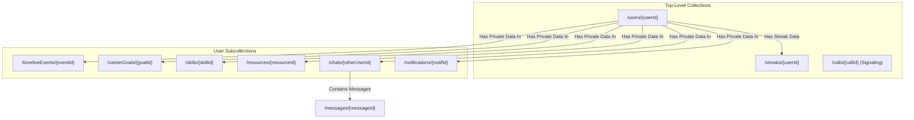

---

# **Technical Implementation Summary**

This section provides a high-level overview of the technologies and architectural patterns used to build the Calendar.ai application.

## **1. Core Frameworks & Libraries**

*   **Next.js & React:** The application is built on **Next.js 15** with **React 18**, utilizing the App Router for a modern, server-centric, and performant architecture.
*   **Genkit:** All AI-powered features, from the Career Vision Planner to email summarization, are built using Google's **Genkit**, an open-source framework designed for creating robust, maintainable, and observable AI flows.
*   **WebRTC:** The real-time audio and video calling suite is built directly on the **WebRTC** protocol, enabling secure, peer-to-peer media streaming and minimizing server overhead.
*   **UI & Styling:**
    *   **Tailwind CSS:** A utility-first CSS framework for rapid and consistent UI development.
    *   **ShadCN UI:** Provides a library of beautifully designed, accessible, and reusable components that form the base of our design system.
    *   **Framer Motion:** Used for all major animations, including the floating AI command bar and page transitions, to create a fluid and polished user experience.

## **2. Backend & Database Structure**

Our entire backend is powered by the **Firebase** ecosystem, providing a scalable and real-time infrastructure for all application data and services.

*   **Firestore:** A NoSQL, document-based database serves as the primary data store for all user information, including profiles, goals, skills, timeline events, and chat histories. It is also cleverly utilized as a real-time signaling server for our WebRTC implementation.
*   **Firebase Authentication:** Handles secure user sign-in and management across multiple providers (Google, Microsoft, Phone OTP, etc.).
*   **Firebase Storage:** Used for storing user-uploaded assets, such as custom profile avatars and background images.
*   **Firebase Cloud Messaging (FCM):** Powers the native browser push notifications for event reminders and social interactions like new followers.

### **Data Relationship Diagram**

This diagram illustrates the main data relationships in our Firestore database.

## **3. External APIs & Services**

*   **Google Workspace APIs:** We have deeply integrated the **Google Calendar, Google Tasks, and Gmail APIs** to provide seamless, real-time data synchronization for users who connect their Google account.
*   **Competitive Programming APIs:** The Codefolio Ally plugin fetches data from the public APIs of **Codeforces, LeetCode (via its GraphQL endpoint), and CodeChef** (leveraging a reliable third-party proxy).
*   **Razorpay API:** Used as the payment gateway for securely processing all subscription payments for monthly and yearly plans.

## **4. Key Libraries & Utilities**

*   **Zod:** Used for schema declaration and validation. It is critical for ensuring that the data flowing into and out of our Genkit AI models is structured and type-safe.
*   **`date-fns`:** A powerful and modern library for all date and time manipulations, which is essential for a calendar-centric application.
*   **`react-hook-form`:** Manages all complex forms within the application, such as the event creation/edit modal, providing robust client-side validation.
*   **`react-grid-layout`:** The core library that powers the customizable, drag-and-drop widget dashboard, enabling a personalized user experience.
*   **`cmdk`:** The underlying component used to build the application's powerful Command Palette (`Ctrl+K`), which serves as a central navigation and action hub.

---

# **Comprehensive Product Update Catalog**

## **1. Comprehensive Data Synchronization**

### **Summary**

Implemented a complete backend synchronization pipeline integrating Google services (Calendar, Tasks, Gmail) with AI-driven data processing and contextualization.

### **Core Functionality**

*   Integrated Google OAuth for user authentication and secure access to Google APIs.
*   Synced Google Calendar, Gmail, and Tasks in real-time.
*   Designed AI models to summarize important emails and automatically convert relevant tasks or events into actionable timeline items.

### **UI Enhancements**

*   Introduced timeline-based visualization for synced events and tasks.
*   Created user-centric data cards to display summarized email insights.

### **Debugging**

*   Resolved token expiration and refresh handling issues during prolonged sync sessions.
*   Fixed edge cases involving invalid scopes and rate-limited API responses.

### **Backend**

*   Implemented service modules to handle secure OAuth tokens and batch data fetches.
*   Added AI filtering and summarization pipeline integrated via backend microservices.

### **Conclusion**

This system established a foundation for intelligent, privacy-aware data synchronization, creating a personalized and dynamic productivity experience.

---

## **2. Customizable Widget Dashboard**

### **Summary**

Replaced the static dashboard with a responsive, customizable grid system supporting role-based layouts and persistent personalization.

### **Core Functionality**

*   Integrated `react-grid-layout` for dynamic widget placement and resizing.
*   Added full edit mode allowing drag, resize, hide, and show operations.
*   Implemented version-controlled layout synchronization between local storage and Firestore.

### **UI Enhancements**

*   Introduced widget management panel with toggle-based visibility.
*   Role-specific layouts for Students and Professionals ensuring a tailored dashboard experience.

### **Debugging**

*   Fixed layout synchronization conflicts between cloud and local data.
*   Addressed grid rendering delays and alignment inconsistencies across devices.

### **Backend**

*   Developed `layoutService.ts` to manage versioning, storage, and layout reconciliation.
*   Synced user layouts across sessions with Firestore integration.

### **Conclusion**

The new dashboard provides complete personalization while maintaining scalability and update compatibility across deployments.

---

## **3. Floating AI Command Bar (Desktop)**

### **Summary**

Implemented an interactive, floating AI-powered command bar designed as the central control and interaction point for the desktop application.

### **Core Functionality**

*   Functions as both a quick launcher and full-screen AI workspace.
*   Integrates AI chat, file browser, and terminal interfaces.
*   Accessible via keyboard shortcuts (Ctrl/Cmd + K).

### **UI Enhancements**

*   Glassmorphic design with animated, multi-color borders.
*   Draggable and position-aware bar with persistent placement memory.
*   Smooth open/close animations using Framer Motion.

### **Debugging**

*   Managed state synchronization across open, minimized, and full-screen modes.
*   Fixed drag offset and z-index issues overlapping chat panels.

### **Backend**

*   Modularized structure using `DesktopCommandBar.tsx` and `AiAssistantChat.tsx`.
*   Optimized rendering and state storage for minimal latency transitions.

### **Conclusion**

The floating AI bar unified multiple productivity tools into one interface, improving accessibility and workflow fluidity for power users.

---

## **4. Public Pages & Onboarding Enhancements**

### **Summary**

Redesigned all public-facing and authentication pages for a modern, cohesive, and interactive user experience.

### **Core Functionality**

*   Rebuilt landing, sign-up, and sign-in pages with animation and multi-provider authentication.
*   Implemented onboarding flow for profile setup and role selection (Student/Professional).

### **UI Enhancements**

*   Animated hero section with layered effects and dynamic feature showcase.
*   Integrated AI chatbot teaser on the landing page with scroll-activated visuals.
*   Unified design theme across sign-in and sign-up pages with motivational backgrounds.

### **Debugging**

*   Resolved authentication redirection and form validation issues.
*   Fixed CSS layering conflicts between background animations and modals.

### **Backend**

*   Added OAuth integrations for Google, Microsoft, Yahoo, and phone-based authentication.
*   Implemented account switcher logic and 30-day recovery system for account deletion.

### **Conclusion**

The new onboarding and authentication experience ensures professionalism, accessibility, and brand consistency from first interaction.

---

## **5. Microsoft Authentication Integration & Azure Debugging**

### **Summary**

Added support for Microsoft personal and work accounts via OAuth, ensuring enterprise-ready login flexibility.

### **Core Functionality**

*   Integrated Microsoft v2.0 endpoints with `/common` tenant support.
*   Securely configured client credentials via environment variables.

### **UI Enhancements**

*   Unified OAuth buttons with consistent styling and provider icons.
*   Integrated account switcher UI in authentication modals.

### **Debugging**

*   Fixed unverified publisher domain issues through `microsoft-identity-association.json`.
*   Corrected callback URI mismatches and endpoint configurations in Azure.

### **Backend**

*   Verified publisher domain setup in `.well-known` directory for domain trust validation.
*   Improved authentication resiliency and error handling logic.

### **Conclusion**

Microsoft authentication now functions seamlessly across environments, strengthening enterprise usability and security compliance.

---

## **6. Student vs. Professional Mode Implementation**

### **Summary**

Introduced dynamic application modes tailored for Students and Professionals, optimizing dashboard content and navigation per user role.

### **Core Functionality**

*   Added `userType` field in Firestore profiles.
*   Role-based rendering for dashboards, widgets, and navigation menus.

### **UI Enhancements**

*   Student dashboards highlight streaks and community features.
*   Professional dashboards focus on integrations and productivity widgets.
*   Implemented toggle switch in sidebar for instant role switching.

### **Debugging**

*   Fixed layout flickering on mode switch and real-time UI re-render issues.

### **Backend**

*   Extended user schema and role persistence logic in onboarding API.
*   Added real-time re-render triggers on `userType` updates.

### **Conclusion**

This feature established two distinct yet unified experiences, serving diverse audience needs within the same codebase.

---

## **7. Avatar System Implementation**

### **Summary**

Developed a centralized avatar system enabling personalized identity management across the platform.

### **Core Functionality**

*   Avatar selection integrated in onboarding.
*   Profile customization via upload or predefined 3D avatars.
*   Real-time avatar synchronization throughout all components.

### **UI Enhancements**

*   Added “Customize Avatar” modal with instant preview.
*   Global avatar refresh mechanism on update.

### **Debugging**

*   Resolved caching issues during avatar updates.
*   Prevented orphaned files with automated storage cleanup.

### **Backend**

*   Managed uploads and deletions through Firebase Storage service.
*   Synced `photoURL` in Firestore and propagated via AuthContext.

### **Conclusion**

The avatar system enhanced user personalization and visual continuity across the application.

---

## **8. Multi-Account Management**

### **Summary**

Built a seamless multi-account system enabling users to manage and switch between multiple authenticated profiles efficiently.

### **Core Functionality**

*   Implemented multi-account session management within `AuthContext`.
*   Enabled quick account switching and session persistence.

### **UI Enhancements**

*   Redesigned header dropdown to list known accounts with avatars and control options.
*   Added “Add Account” and “Sign out of all accounts” functionality.

### **Debugging**

*   Fixed localStorage desync issues after sign-out.
*   Resolved Google sign-in conflicts caused by overlapping OAuth sessions.

### **Backend**

*   Stored known user data locally for quick re-login.
*   Integrated Firebase `signInWithPopup` with contextual `login_hint` for targeted account switching.

### **Conclusion**

This system streamlined multi-profile management, offering a fast and frictionless sign-in experience akin to major productivity platforms.

---

## **9. Landing Page AI Chatbot & Video Background**

### **Summary**

Deployed an AI-powered Q&A chatbot on the landing page, supplemented by immersive video and animation backgrounds.

### **Core Functionality**

*   Knowledge-based AI answering product-related queries from an embedded knowledge base.
*   Context-aware session memory for conversational continuity.
*   Implemented fallback responses for network failures.

### **UI Enhancements**

*   Floating Lottie-based orb expanding into a full chat interface.
*   Background video and animated gradients providing visual depth and motion.
*   Modern message interface with dynamic loading indicators.

### **Debugging**

*   Resolved animation overlap between video layers and chat UI.
*   Fixed chatbot fallback handling on Genkit service timeouts.

### **Backend**

*   Integrated Genkit flow (`webapp-qa-flow.ts`) for natural language processing.
*   Embedded predefined responses for critical queries like pricing and policies.

### **Conclusion**

The AI chatbot transformed the landing experience into an interactive, knowledge-driven introduction to the product.

---

# **References**

*   **Google Cloud Platform Documentation** – OAuth 2.0 and API Scopes
*   **Microsoft Identity Platform** – OAuth v2.0 and App Registration Guidelines
*   **Firebase Documentation** – Firestore, Storage, and Authentication
*   **Framer Motion** – Advanced Animation Framework for React
*   **React Grid Layout** – Responsive Grid System for Dashboard Customization
*   **Genkit Framework** – AI Workflow Engine for Contextual Q&A
*   **Azure Active Directory Documentation** – Domain Verification & Redirect URI Setup

---

*   **Author:** [Ashish Yesale](https://github.com/AshishYesale7)
*   **Contact:** [ashishyesale007@gmail.com](mailto:ashishyesale007@gmail.com)
